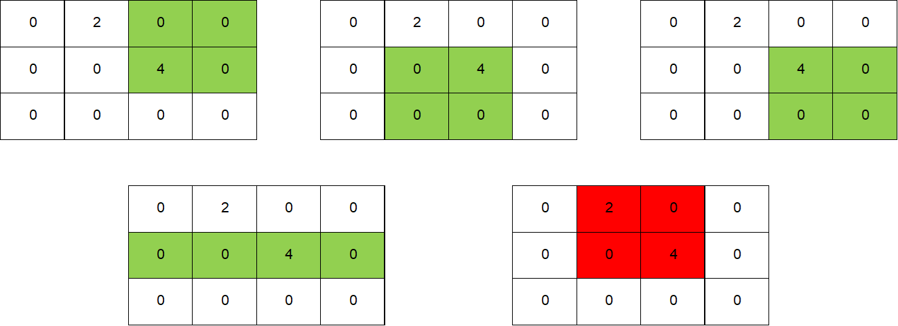

# Shikaku Skill Builder

Puzzle: Shikaku Skill Builder [Awaiting Approval - See CG Contribution Page](https://www.codingame.com/contribute/community)

Author: [@Timinator](https://www.codingame.com/profile/2df7157da821f39bbf6b36efae1568142907334)

Published Difficulty: Easy

# Visualizing the Problem

Shikaku is a great place to start because the directions have a decent chance of putting you on a path that might lead to a dead end. According to the [Shikaku Solver](https://www.codingame.com/training/medium/shikaku-solver) puzzle specification:

>The objective is to divide the grid into rectangular pieces such that each piece contains exactly one number, and that number represents the area of the rectangle.

That is all true, but “dividing” is not something we have discussed in terms of visualizing an exact cover problem. Let’s look at Shikaku a different way. Consider that you start with an outline of the grid with some numbers penciled in. You also have a large pile of rectangular tiles, each one having a certain width and height. Your job is to place tiles on the grid one-by-one, covering the penciled-in numbers with appropriately-sized tiles (tile area equal to number on grid), until the entire grid is covered with tiles.

Algorithm X doesn’t know how to “divide” things up. Algorithm X is extremely good at finding a subset of a “large pile” of options and it is critical that we give Algorithm X a __complete__ set of “tiles” from which it can pick and choose to build valid solutions.

# Skill Building

In the Shikaku Skill Builder puzzle, the grids start very small and even the largest grid is just the smallest test case from the [Shikaku Solver](https://www.codingame.com/training/medium/shikaku-solver) puzzle. The goal of Shikaku Skill Builder is to practice enumerating all the possible actions. Let’s test your understanding.

# Start Out Easy

```
          0 0 0
          0 9 0
          0 0 0
```

?[Given the grid above, how many ways can you place a tile with area 9 on the grid such that the number 9 is covered?]
- [ ] I have no idea. 
- [ ] 4
- [ ] 3 
- [x] 1

"Starting out easy" might have been an understatement, right? There are only 3 ways to create a rectangle with area equal to 9: 3x3, 1x9 and 9x1. Since the grid is only 3 squares wide and 3 squares high, the only option is a 3x3 square that covers the entire grid.

<BR>


# 2x1 vs 1x2

```
          0 2 0 0
          0 0 4 0
          0 0 0 0
```


?[Given the grid above, how many ways can you place a tile with area 2 on the grid such that the number 2 is covered? Remember your tile must cover the 2, but it MUST NOT cover any other number]
- [ ] I have no idea. 
- [ ] 4
- [x] 3 
- [ ] 1

In this second example, rectangles of different widths and heights exist. In the puzzle, you will need to find every combination of height and width that creates the proper area and then figure out each location you could put the top-left corner and __only__ cover the number in question.

<BR>


# Rectangles Cannot Cover Two Numbers

```
          0 2 0 0
          0 0 4 0
          0 0 0 0
```

?[Given the grid above, how many ways can you place a tile with area 4 on the grid such that the number 4 is covered? Remember your tile must cover the 4, but it MUST NOT cover any other number.]
- [ ] I have no idea. 
- [x] 4
- [ ] 3 
- [ ] 1

In this third example, we see there is one place a 2x2 grid will not work because it covers a second number. Don’t forget to try all combinations of width and height! Just looking at this grid visually, it is easy to miss the 1x4 rectangle.

<BR>



# Ready for the Puzzle!

With the Shikaku Skill Builder puzzle, the goal is not to cover the grid. The goal is to identify __every__ rectangle that could be used to build a potential solution. As I mentioned earlier, Algorithm X is really good at finding a set of actions that make a valid solution, but it cannot do its job unless you give it a full set of possible actions to consider. Hopefully this seems obvious and somewhat easy right now. As the puzzles grow in complexity, this process will get more and more challenging!
