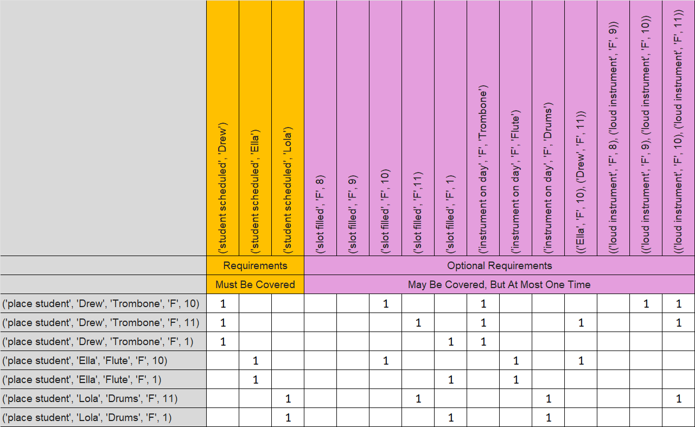
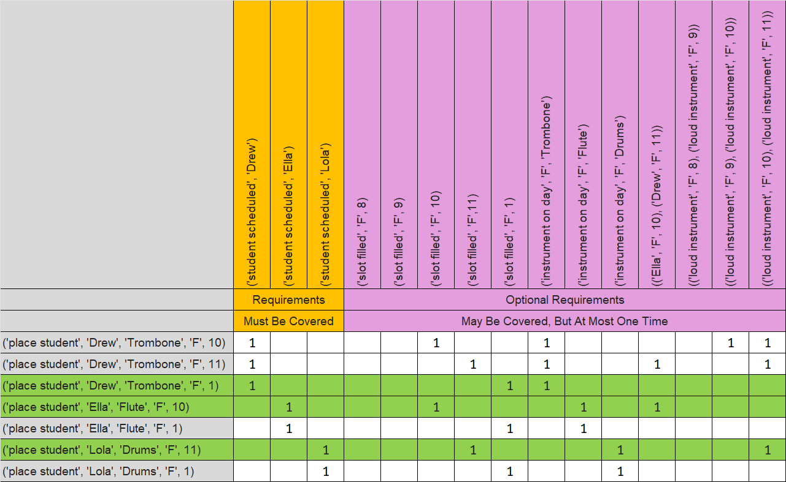
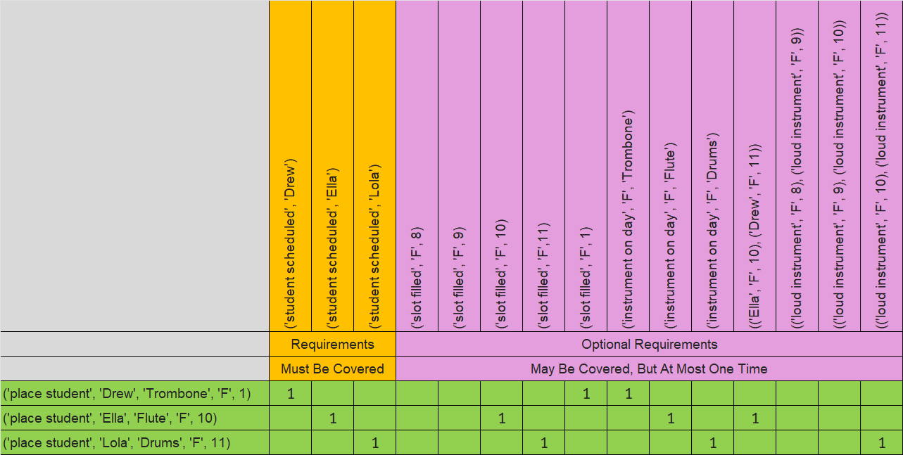

# Visualizing the Model - Mrs Knuth Part II

The matrix below shows which requirements are satisfied by each action. Mrs. Knuth - Part II does not add an overwhelming amount of complexity, yet the matrix has grown enough, even on the tiny example exercise, that it is no longer trivial to identify an exact cover just by looking at it.

  

 

In the next matrix, the rows that make up the only solution are highlighted. It is very easy to see columns that are not necessary since they are not covered by any rows. Eventually, it may be important to optimize your matrix where possible, but you can trust me for now, Algorithm X quickly handles _all_ Mrs. Knuth test cases without any effort to make sure empty columns have been eliminated.

  

 

Like we have done before, let's hide the unused rows to highlight the _exact cover_.

  

 

In the next section, I’ll discuss how to add optional requirements to your `AlogrithmXSolver` subclass.
