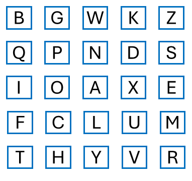
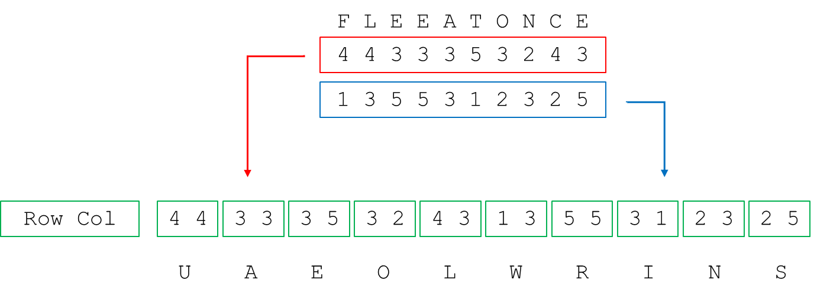
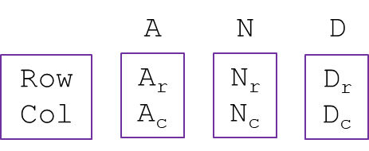
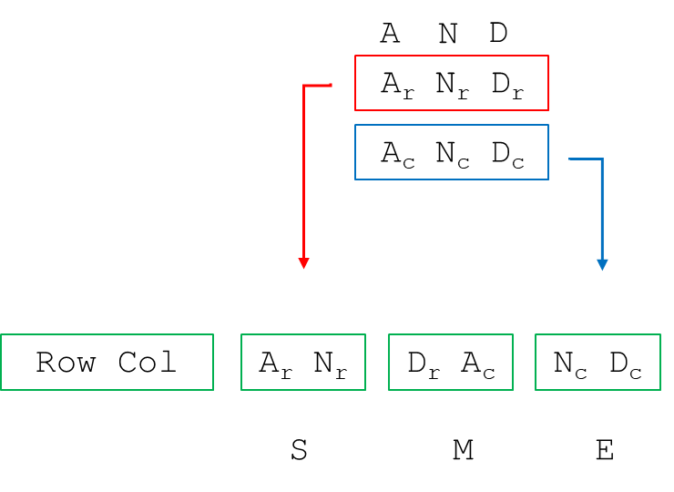
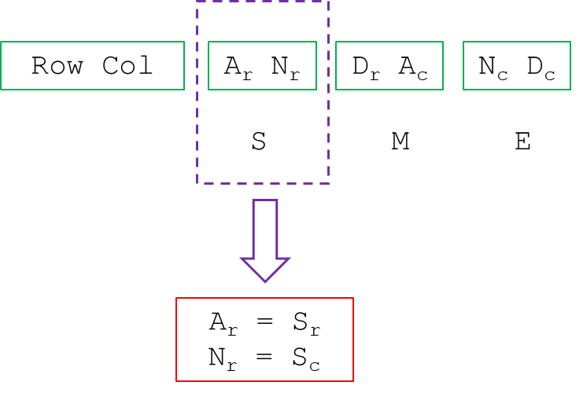

# Breaking Bifid

__Puzzle:__ [Breaking Bifid](https://www.codingame.com/training/hard/breaking-bifid)

__Author:__ [@therealbeef](https://www.codingame.com/profile/ecad91b9a50d51a3d9515d303487dd7c7077604)

__Published Difficulty:__ Hard

__Algorithm X Complexity:__ Imagine Untangling the World's Largest Pile of Holiday Lights

# Puzzle Overview

In Breaking Bifid, you are given a `plainText1` string and a `cipherText1` string. You need to figure out the makeup of the key, the _Polybius square_, used to encrypt `plainText1`. Once you have the key (a completed square) you can decode a third string, `cipherText2`. Before we explore how to look at this problem as an exact cover, let’s first review the process laid out in the goal statement.

>Bifid uses a Polybius square as a key. This is a 5 by 5 square containing 25 letters of the alphabet (the J is merged with I), in an arbitrary order. For example:

  

 

>To encrypt a plaintext, we start by removing spaces and replacing each J by an I. Underneath each letter in the resulting text we write the coordinates (row and column) of that letter in the Polybius square:

  

 

>The two lines of numbers are written after each other:

  

 

>The numbers are then grouped in pairs, and the pairs are used as coordinates into the Polybius square (the first number being the row, and second being the column), to find the letters of the ciphertext:

  

 

# Looking at the Puzzle as an Exact Cover

Let’s now consider an example similar in structure to the test cases and try to identify actions and requirements for Algorithm X in hopes that Algorithm X can identify how the Polybius square should be constructed. In the next diagram, I have short 3-letter strings for `plainText1` and `cipherText1`, but the entire Polybius square is completely blank.

  

 

The action steps I can take to build a solution are pretty simple. One at a time, a letter of the alphabet (J is excluded) can be placed in one of the 25 squares. As for requirements, the only obvious requirements are that every letter be used and every square be covered. That is not super helpful because a tremendous number of possible combinations satisfy those requirements. Let's work through the process laid out by the author once again, this time taking into account we don't know the letters in the key.

>To encrypt a plaintext, we start by removing spaces and replacing each J by an I. Underneath each letter in the resulting text we write the coordinates (row and column) of that letter in the Polybius square:

Each letter's coordinates are unknown so I will add subscripts to refer to the rows and columns of the letters.

  

 

>The two lines of numbers are written after each other:

  

 

>The numbers are then grouped in pairs, and the pairs are used as coordinates into the Polybius square (the first number being the row, and second being the column), to find the letters of the ciphertext:

  

 

At the risk of being repetitive, I will quote the author's problem statement one last time:

>the pairs are used as coordinates into the Polybius square (the first number being the row, and second being the column), to find the letters of the ciphertext:

The first pair, (row of A, row of N), tells us where to look in the Polybius square to find the first ciphertext letter, S. From that, we know:

  

 

We finally have some requirements more interesting than a letter needing to be put on the grid. We know that A and S must be in the same row! These two things must be the same, or in other words...they must not be different. Hopefully you did [Einstein's Riddle Solver](https://www.codingame.com/training/hard/einsteins-riddle-solver) and you remember how to turn items that must be the same into a set of mutually exclusive items. If not, it might be time to go back and finish that puzzle first! 
