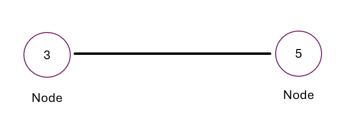
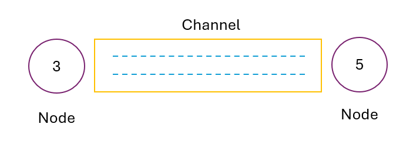
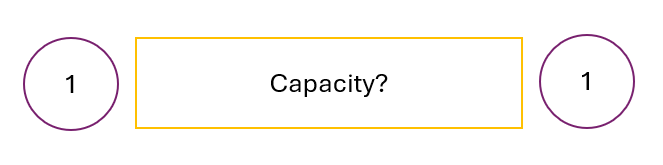

# There Is No Spoon - Episode 2

__Puzzle:__ [There Is No Spoon - Episode 2](https://www.codingame.com/training/hard/there-is-no-spoon-episode-2)

__Published Difficulty:__ Hard

__Algorithm X Complexity:__ Strap In and Hold On Tight

# A Past Contest

[There is No Spoon]( https://www.codingame.com/contests/there-is-no-spoon/leaderboard) was a contest in April 2015 and the winner passed all test cases and validators in less than 90 minutes! The puzzle is based on the logic puzzle, [Hashiwokakero]( https://en.wikipedia.org/wiki/Hashiwokakero), which translates to “build a bridge”. You will find websites that refer to the game as “bridge building”, “bridges” or some other variation. Today, it is easy to find websites that will let you work Hashiwokakero puzzles if you’d like to get a better feel for how the game is played.

[Bridges from Simon Tatham’s Portable Puzzle Collection]( https://www.chiark.greenend.org.uk/~sgtatham/puzzles/js/bridges.html)

[Play Hashiwokakero on SilverGames.com]( https://www.silvergames.com/en/hashiwokakero)

__CodinGame uses the terms _NODE_ and _LINK_ instead of the terms _island_ and _bridge_ to identify a connection between two islands/nodes. From here forward, I am going to use the CodinGame puzzle terms _NODE_ and _LINK_.__

# Visualizing the Problem

I believe using the analogy of tiles on a gameboard is the key to a successful Algorithm X approach to this puzzle. What does the gameboard look like? At first glance, the gameboard appears to be a blank slate with nothing except a bunch of nodes, each with a number indicating how many links need to be connected to the node.

  

 

I contend there is much more to the gameboard that is subtly hidden. I will come back to that, but first we need to investigate the action steps that can be taken to create a solution. It seems straightforward the only action we can take to work toward a solution is to put a link between two Nodes, similar to this:

  

 

Where do I put the link? Yes, I know the link goes between the two Nodes, but where exactly do I place my “link tile” on the gameboard? How does the gameboard indicate to me that I can put one or two links between Nodes, but I cannot put three? There is something between the Nodes that is not explicit in the description, but it is definitely there. I’m going to call this space between Nodes, where a link can be placed, a Channel.

  

 

I can put 0, 1 or 2 links in any Channel. Let’s add dotted lines to each Channel to represent a slot or a placeholder for a future link. My gameboard is much clearer now. To create a solution, I can put links on the gameboard anywhere I see an open slot (dashed line) inside a Channel between Nodes.

  

 

What about the places where Channels cross? These seem to be very important locations since links are not allowed to cross each other. Any two Channels that cross each other could create future problems. Channels can only cross each other at grid locations that are not Nodes. Let’s call every non-Node grid location an Intersection and build our full gameboard from scratch, starting with just Nodes and Intersections:

  

 

Once I fully understand the layout of my gameboard, the only important Intersections will be the intersections that have crossing Channels. Even then, nothing is terribly important about an Intersection until a link is placed in one of the slots of a Channel. At that point, the other Channel in the Intersection is no longer in play. It needs to be removed from the realm of possibility. No links can ever be placed in the second Channel.

This next diagram displays the entire gameboard before any links are placed. For just a minute, consider how much more detailed this gameboard is compared to the original gameboard. No actions have been taken. No links have been placed. We have only taken the time to build a more detailed, and possibly more meaningful, understanding of the gameboard.

  

 

Summarizing the gameboard now, we see the following components:

__Node__ – a location on the gameboard that needs a certain number of links.

__Channel__ – a trench between two Nodes, inside of which can be placed some number of links. A Channel’s link capacity is determined by several factors discussed below, but it can never be more than 2. A Channel may or may not pass through Intersections as it travels between the two Nodes it connects

__Intersection__ – a non-Node location on the gameboard that knows about any Channel that passes through that location

Every Channel has capacity for a certain number of links. For now, this is the only attribute that requires a bit of discussion:

__Channel Capacity__ – in general, a Channel’s initial link capacity is determined by the following formula: `minimum(2, node1 links needed, node 2 links needed)`. There are two important exceptions to this rule.

  

 

_Exception #1_: In the above diagram, each Node connected by the Channel needs 1 link. If these are the only two Nodes in the puzzle, the Channel capacity is 1. If there are more than two Nodes in the puzzle, the Channel capacity is zero since putting a link between the two nodes would create a connected group that could not be connected to the rest of the puzzle.

  

 

_Exception #2_: In the above diagram, each Node connected by the Channel needs 2 links. If these are the only two Nodes in the puzzle, the Channel capacity is 2. If there are more than two Nodes in the puzzle, the Channel capacity is 1 since putting two links between the two Nodes would create a connected group that could not be connected to the rest of the puzzle.

# Object-Oriented Analysis

Object-Oriented Programming is a popular topic in the world of Computer Science, but how did that come about? Thought leaders believe the world we live in is object-oriented and matching our code structure to the world we observe might have benefits. I contend we have just finished building an object-oriented understanding, or _Analysis_, of our problem space. Next, I'll show you how to turn that _Object-Oriented Analysis_ into an _Object-Oriented Design_ that makes the job of identifying actions and requirements for Algorithm X significantly easier than it might have seemed at first.
