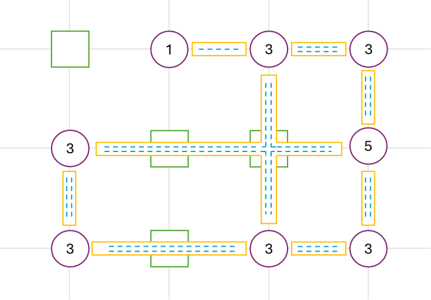
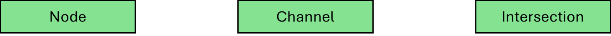
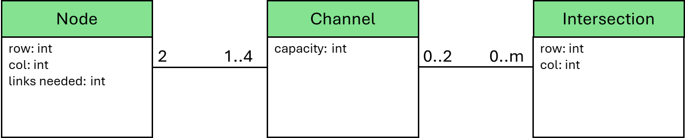

# There Is No Spoon - Episode 2 (cont.)

We just finished building the following detailed gameboard and a link can be placed on any dashed line.

  

 

# An Object-Oriented Model of the Problem Space

Before we identify requirements and actions for Algorithm X, let’s take an inventory of what we see on our gameboard. We see a bunch of Nodes, a bunch of Intersections and a bunch of channels. Let’s create a class for each of these.

  

 

How will the relationships among instances of these three classes be managed? What information is needed to recreate the gameboard from scratch? Consider the following:

* __Node__
    * has a (row, col) location on the gameboard
    * is connected to between 1 and 4 Channels
    * needs a certain number of links connected to it
    
* __Channel__
    - connects exactly 2 Nodes
    - has a capacity, some number of unused slots where links can be placed
    - passes through 0 to many Intersections

* __Intersection__
    - has a (row, col) location on the gameboard
    - has 0, 1 or 2 Channels passing through it
 
These observations lead us to create the following object-oriented model of our problem space. 

  

 

I am streamlining the process a bit, but if we add a few attributes to the classes, we can make our model a bit more concrete. Some might call these features the difference between the object-oriented analysis model of the problem space and an object-oriented design model that guides us to an implementation.

  

 

Looking at the problem space this way is probably not the first thought most people have. It is likely more common to think each Node will need to know about its neighbor Nodes. In the model created here, Nodes do not know anything about other Nodes on the gameboard. Much of the information a Node needs access to is found in its Channels. A Node is interested in how many Channels it is connected to and how much link capacity those Channels provide. A Channel becomes the manager of the relationship between 2 Nodes. Without the Channel, those 2 Nodes really don't have any relationship at all. It is important to remember where this perspective originated. It came from thinking of the problem as a gameboard and a number of tiles that need to be placed on the gameboard.

# Giving Life to the Gameboard

At this point, classes exist for each key abstraction on the gameboard. It is time to create instances of each class and build the relationships among the objects.

__Step 1:__ For every Node location on the initial gameboard, create an instance of the `Node` class. The only information available for a `Node` is the `(row, col)` location on the gameboard and the number of needed links.

__Step 2:__ For every non-Node location on the initial gameboard, create an instance of an `Intersection` with nothing more than a `(row, col)` location.

Did you complete [There is No Spoon – Episode 1](https://www.codingame.com/training/medium/there-is-no-spoon-episode-1)? Now is the time to use what you learned on that puzzle. For every `Node`, determine if it has a horizontal neighbor to the right and determine if it has a vertical neighbor below. It is only necessary to check in 2 directions. As long as every `Node` is explored in those two directions, all `Channel`s will be found. 

__Step 3:__ For every `Node`, if there is a neighbor to the right, create a `Channel` and if there is a neighbor below, create a second `Channel`. It should be straightforward to build a list of `Intersection`s as you search for neighbors. When a `Channel` is created, it needs to know about the 2 `Node`s it connects and it needs a list of `Intersection`s it passes through.

That is all for now. Not a single link has been placed, but the gameboard has been explored in tremendous detail and the perspective, with which the gameboard has been understood, is the key to the next step where the preliminary Object-Oriented Design guides the process of creating the matrix for Algorithm X.
