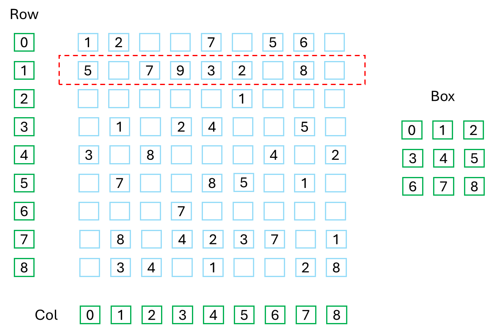
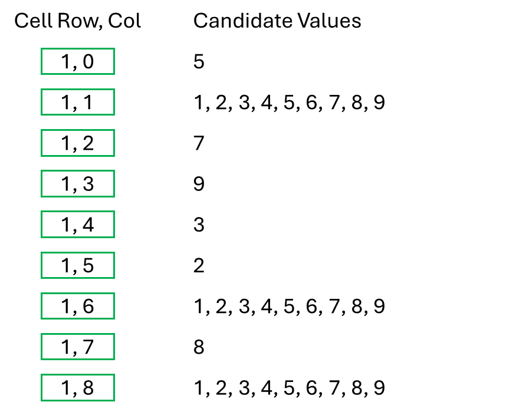
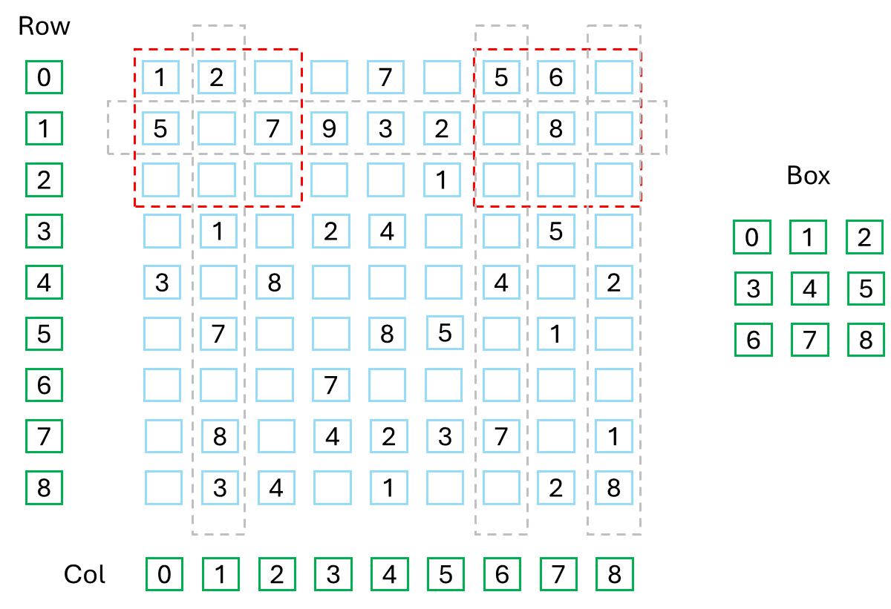

# Sudoku Problem-Space Reduction

To reduce the problem space, it is helpful to consider how you might go about solving the problem by hand. With a Sudoku, you might start by looking at each row, column and box separately. You could consider what you know about each group of cells and how that knowledge allows you to reduce the possible values of other cells.

Using the Sudoku identified on the previous page, first create a list of all possible numbers, or _candidate values_, for each cell. If the cell is already known, that list contains a single number. If the cell is unknown, the initial list of candidates contains all the numbers from `1` to `9`. The more known numbers in a group, the easier it might be to identify numbers that belong in other cells. Row 1 already has 6 known numbers, making it a good place to start.

  

 

The next diagram shows the candidates for each cell in row 1.

  

 

Because numbers cannot be duplicated in a row, the numbers in the known cells can be removed from each unknown cells' candidates.

  

 

Each of the unknown cells is also in a column where, again, numbers cannot repeat. Column 1 already has a `1`, column 6 already has a `4` and column 8 already has a `1`.

  

 

Based on the known numbers found in the other cells of each of the three columns, the candidates can be reduced even further. The three unknown cells in row 1 now have only 2 possibilities each.

  

 

Lastly, each of the unknown cells in row 1 is also part of a box and that box must not have duplicates. 

  

 

Box 0 does not help at this time, but box 2 already has a `6` and that `6` can be removed from the candidates for each cell in box 2.

  

 

We have come full circle, and it is again time to look at row 1 where we now see 8 of the 9 cells with a single possibility, making it very easy to reduce the last cell to a single possibility. The Sudoku grid now has 3 more known numbers:

  

 

# Putting It All Together

A traditional Sudoku has 9 rows, 9 columns and 9 boxes. All rows, columns and boxes behave exactly the same. Rather than using the terms rows, columns and boxes, I will call them all _sudoku cell groups_. The problem can be generalized to 27 sudoku cell groups. Each group has 9 cells, and each group must contain all the numbers from `1` to `9`.

To reduce a Sudoku problem space, by hand or by algorithm, you must repeatedly loop through all 27 groups, logically reducing the candidates of any unknown cell where you can. If you loop through all 27 groups and not a single update is made, your logic is either missing something or maybe the puzzle just cannot be solved completely with logic. Either way, it is time to start guessing and backtracking where necessary.

Next, I will propose a structure for your code and a basic algorithm to facilitate problem-space reduction on any of the puzzles for which the problem space is too big for Algorithm X alone. But first, a very short look at variables in Python.
