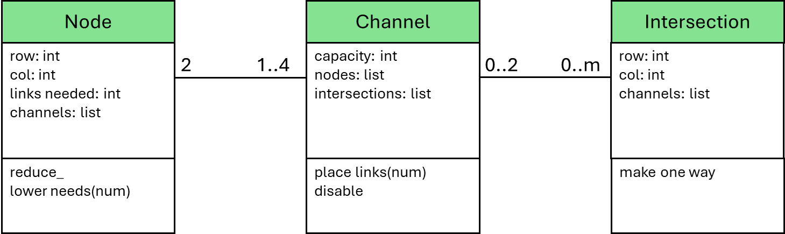
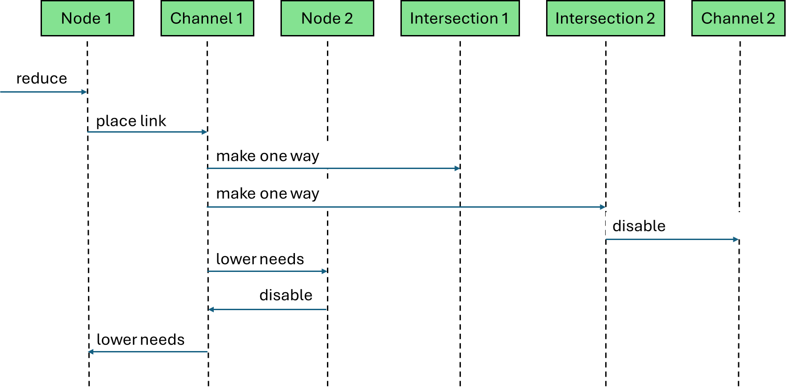

# There Is No Spoon - Episode 2

__Puzzle:__ [There Is No Spoon - Episode 2](https://www.codingame.com/training/hard/there-is-no-spoon-episode-2)

__Published Difficulty:__ Hard

__Algorithm X Complexity:__ Strap in and hold on tight!

# Reducing the Problem Space

When we last discussed There is No Spoon – Episode 2, I left you with the following class diagram:

<BR><BR>

<BR>

To do some problem-space reduction, it seems reasonable we will add a `reduce_()` method to one or more of the classes, but which ones? Distributing behavior to classes can be difficult and sometimes easy to argue one way or another. Let’s look at each class individually.

`Intersection` - this seems like the least likely location for a `reduce_()` method. `Intersection`s have very little intelligence. They must be able to react to a single event sent by a `Channel` letting the `Intersection` know that a link has been placed and if there is another `Channel` in the intersection, it should be disabled.

`Channel` - this again seems like an unlikely location for a `reduce_()` method. What would it even mean to reduce a `Channel`? Sure, the `Channel` knows about the `Nodes` on either side, but that is not enough to know whether or not a link must be placed in the `Channel`. I see a `Channel` needing to be able to react to two events:

1. A `Node` might tell a `Channel` to place 1 or 2 links in its slots.

1. A `Node` or an `Intersection` could send an event to disable a `Channel`. We already saw how this could happen with an `Intersection`. With a `Node`, links in other `Channel`s could bring the `Node`’s needed links down to zero. At that point, all `Channel`s attached to that `Node` need to be disabled so they cannot accept more links.

`Node` - this seems like a very appropriate place for a `reduce_()` method. A `Node` knows how many links it needs and it can easily calculate the total capacity of its `Channel`s. It seems very reasonable that reducing a `Node` could result in the `Node` asking one or more of its `Channels` to place 1 or 2 links in its slots.

# One Potential Sequence of Events

Based on everything said above, the following methods might be useful in each of the classes:

<BR><BR>

<BR>

The next diagram captures one sequence of events that could result after a call to `reduce_()` on a particular `Node`. 

<BR><BR>

<BR>

A `Node` determines that a link can be placed in a `Channel`. The `Node` asks the `Channel` to place a link. The `Channel` sends an event to every `Intersection` it passes through telling each `Intersection` to make the path one-way. Any `Intersection` that has a second `Channel` sends a message to the second `Channel` to have that `Channel` disabled. Finally, the original `Channel` needs to tell the `Node`s on either end to lower their needed link counts appropriately. Any `Node` that has all its links fully satisfied makes sure its connected `Channel`s are all disabled.

It might be tempting to think I made this harder than it needs to be. I invite you to play around with it. If you choose to create an object-oriented structure for this puzzle, you can easily run into issues caused by less than optimum allocation of behavior to your classes.

# Building a Partial Solution

The same code structure can be used for the reduction loop:

```python
need_to_reduce = True
while need_to_reduce:
    need_to_reduce = False
    for node in self.nodes:
        if node.reduce_():
            need_to_reduce = True
```

Once this loop finishes, you are left with a partial solution. Some number of links have been placed between `Node`s and all those `Node`s have lowered their needed link totals. The remaining problem is a smaller, standalone version of the problem that can be solved with no knowledge of what has been accomplished with the logic above. This puzzle is a great candidate for the 3rd option I discussed many pages ago for handling preselected actions. I suggest the following:

1. Build a list of links placed with the logic above.

1. Feed the remaining, smaller problem to Algorithm X with no knowledge of what was accomplished logically.

1. Combine the original list of links with the solution Algorithm X finds to create an overall solution that can be validated to determine if you have a single group of linked `Node`s.

# Your Goal

Using only problem-space reduction logic, no backtracking at all, you can solve test cases 1 – 8 and 10. To solve all the test cases with Algorithm X, you will need to use some pre-backtracking logic to shrink the size of the problem you give to Algorithm X.
