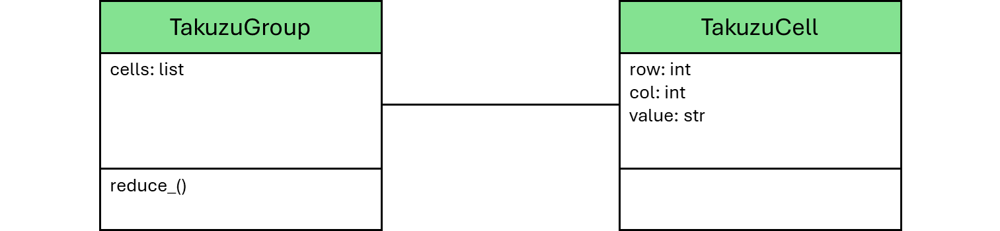

# Takuzu Solver

__Puzzle:__ [Takuzu Solver](https://www.codingame.com/training/hard/takuzu-solver)

__Author:__ [@vinc-r](https://www.codingame.com/profile/fb82e6cef7c3f73e81256761a6cac2043494314)

__Published Difficulty:__ Hard

__Algorithm X Complexity:__ Enjoyably Complex: A Bit of Everything Covered So Far

# Limited Options

Unlike many logic puzzles, Takuzu has very limited options. Each cell can be a `0` or a `1`. Solving a Takuzu is still challenging, but the limited cell options make it a bit easier to focus on problem-space reduction and setting up Algorithm X.

# Algorithm X Setup

Let's start with an excerpt from the goal statement for the puzzle:

>The objective is to fill the grid with 1s and 0s, constraints are :
> - an equal number of 1s and 0s in each row and column
> - no more than two of either number adjacent to each other
> - no identical rows and no identical columns

The basic Algorithm X requirements and actions seem straightforward. Every cell must be covered with a `0` or a `1`, while the actions are all putting a `0` or a `1` into some cell. Is everything truly as straightforward as it appears? Were you able to see the multiplicity in this puzzle?

>- an equal number of 1s and 0s in each row and column

If a row is 8 characters long and it already has two `0`s and one `1`, you know you must place an additional two `0`s and three `1`s in that row. This is textbook multiplicity.

Mutual exclusivity is where Takuzu Solver gets very interesting. Any time you see something cannot happen, you should look for mutual exclusivity.

> - no more than two of either number adjacent to each other

The puzzle allows `00` or `11` to occur in a row or a column, but a series of 3 or more like numbers is not allowed. All discussions of mutual exclusivity so far have involved 2 items being mutually exclusive, but here we have 3 unknown items and our solver needs to make sure not to fill those cells with `000` or `111`. Maybe there is a way to address this, but if there is, I am not aware of it and this is a dead-end tangent.

Although a pattern of `...` appears to be a dead end, what about a series of 3 cells where only one cell is known, for instance `..0`? You could put a zero in either unknown spot, but you cannot put a zero in both spots. This sounds much more in line with the Algorithm X mutual exclusivity discussed in this playground. Actually, it sounds just like Mrs. Knuth putting a loud instrument in one slot or the other, but not being allowed to put a loud instrument in both slots.

# Algorithm X Alone, No Problem-Space Reduction

You can solve the first 3 test cases with no problem-space reduction, only Algorithm X. You will need to override `AlgorithmXSolver`'s `_process_solution()` method to check your final grid for the following.

> - no more than two of either number adjacent to each other
> - no identical rows and no identical columns

If you want to set Algorithm X up in steps, consider this. Even if you completely ignore mutual exclusivity, your solver will easily find solutions for __Test Case 1: Test 4x4__ and __Test Case 2: Test 6x6__. Without adding optional requirements to handle mutual exclusivity, I expect you will timeout on the 3rd test case.

This puzzle is a great example of the power of mutual exclusivity. With decent problem-space reduction, you can pass all validators even if you completely ignore mutual exclusivity. However, if you want super fast solutions for every test case and every validator, mutual exclusivity is critical.


# Problem-Space Setup

To solve all test cases and validators, you will need to do some problem-space reduction. Takuzu has a very similar structure to Sudoku. There are cells and those cells are grouped into rows and columns, but because the cells can only contain zeros and ones, I found little code I could reuse, other than the overall structure.

<BR><BR>

<BR>

If you use this structure, setting up the grid, the rows and the columns is extremely similar to setting up a Sudoku.


```
class TakuzuSolver(AlgorithmXSolver):

    def __init__(self, grid: List[List[str]]):

        self.size = len(grid)
        self.grid = {(r, c):TakuzuCell(r, c, val) for r, row in enumerate(grid) for c, val in enumerate(row)}
        self.rows = [TakuzuGroup([self.grid[(r, c)] for c in range(self.size)]) for r in range(self.size)]
        self.cols = [TakuzuGroup([self.grid[(r, c)] for r in range(self.size)]) for c in range(self.size)]
```

# Reducing the Problem Space

The loop for problem-space reduction should look very familiar.

```
        need_to_reduce = True
        while need_to_reduce:
            need_to_reduce = False
            for group in self.rows + self.cols:
                if group.reduce_():
                    need_to_reduce = True
```

I share this code again to demonstrate the power of a reusable approach to similar problems. You might come up with a completely different approach and that is perfectly okay. Keep in mind, there are many logic puzzles and a significant number of those puzzles are a grid of cells grouped into rows, cols, boxes, cages, etc. More generally,  _a significant number of those puzzles are a grid of cells organized into groups._ Whatever structure works for you, I invite you to look for opportunities to reuse the work you have already done.

Unfortunately, this is where the similarities to Sudoku end! There is a lot of great problem-space reduction possible in Takuzu and the best place to start is again with the puzzle description.

>The objective is to fill the grid with 1s and 0s, constraints are :
> - an equal number of 1s and 0s in each row and column
> - no more than two of either number adjacent to each other
> - no identical rows and no identical columns

The third bullet point does not help. Logical problem-space reduction is only concerned with finding pieces of the solution that __must__ be part of a proper solution. Identical rows or columns are an indicator of an improper solution.

The first two bullet points are the guidance you need to logically fill in more cells of the grid before Algorithm X begins searching for a full solution. There are plenty of techniques you can find to fill in unknown cells. You do not have to find them all to pass every test case and validator. However, if you are overcome by the sweet, sweet logic pulling at you like the Death Star's tractor beam, it might be best not to fight it.

[Wookieepedia- Tractor Beam](https://starwars.fandom.com/wiki/Tractor_beam/Legends)

<BR>

# Solving Logic Puzzles Logically

Many __Takuzu__ puzzles can be solved without making any guesses. Click [here](solving-with-logic-only) to see my progress toward solving as many logic puzzles as possible, strictly with logic, no guessing.

