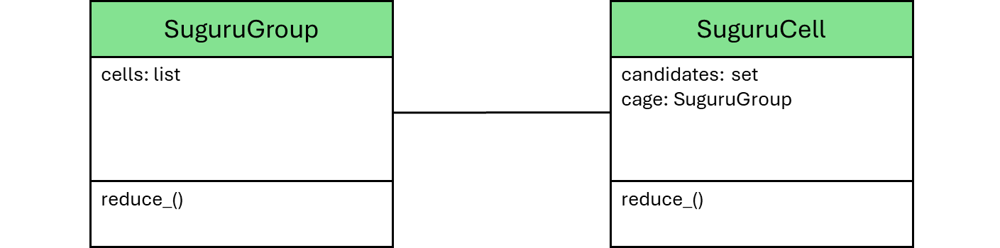

# Suguru Solver

__Puzzle:__ [Suguru Solver](https://www.codingame.com/training/medium/suguru-solver)

__Author:__ [@Saur2000](https://www.codingame.com/profile/62bc28921f6a079fc385c6d3ac38a6659876124)

__Published Difficulty:__ Medium

__Algorithm X Complexity:__ Sudoku Times Two

# Strategy

Suguru is full of wonderful opportunities for problem-space reduction. Just a couple of strategies will be enough to make your `SuguruSolver` very fast. If you are so inclined, you can solve many of the test cases and validators completely with logic.

The cages make Suguru a bit tougher to get organized at first, but a `SuguruCell` is very similar to a `SudokuCell` and a `SuguruGroup` is very similar to a `SudokuGroup`. The key differences are the number of groups to which a cell belongs and the range of candidates for each cell. 

<BR><BR>

<BR>

Unless you are trying to build a generic logic puzzle structure, I see no need to inherit from a common class at this time, but you should be able to reuse some code. Ultimately, you will want to parse the input and end up with the following two attributes in your `SuguruSolver` class:

```
self.grid = dictionary of SuguruCell instances with each key being a (row, col) tuple

self.cages = list of SuguruGroup instances, each with a list of pointers to the cells in the group
```

Once that is complete, you are ready for a standard reduction loop. Hopefully this sounds repetitive. Seeing the similarities in various problems and applying reusable problem solving techniques and design architectures can be a very powerful approach to your software engineering projects.
