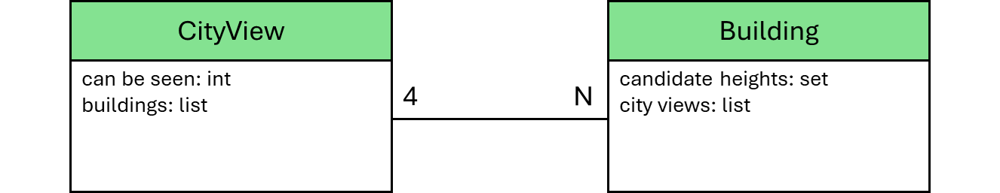

# High-Rise Buildings

__Puzzle:__ [High-Rise Buildings](https://www.codingame.com/training/expert/high-rise-buildings)

__Author:__ [@dwarfie](https://www.codingame.com/profile/2ad5cc4919ed368f16de4aecd570e21e477551)

__Published Difficulty:__ Very Hard

__Algorithm X Complexity:__ Setting Up Algorithm X is the Easy Part

# Strategy

As you get more and more experienced with Algorithm X, puzzles like High-Rise Buildings should be screaming to you, “Solve me with Algorithm X!” Let’s consider the toy example and the puzzle rules from the goal section.

  

 

>Given a grid of dimension NxN, you must build towers on each square in such a way that:
>- The heights of the towers range from 1 to N;
>- Each row contains every possible height of tower exactly once;
>- Each column contains every possible height of tower exactly once;
>- Each numeric clue describes the number of towers that can be seen if you look into the square from that position.

Did I read that correctly? The puzzle goal couldn’t be any clearer about the requirements for Algorithm X.

>build towers on each square

>Each row contains every possible height of tower exactly once;

>Each column contains every possible height of tower exactly once;

# Every Story Needs a Hero

If anything, the last rule is the most challenging. For an `N` x `N` square, there are `4 * N` “positions” from which you can look into the square. A clue is given for each viewing position indicating how many buildings can been seen. Each building blocks the view of any shorter buildings behind it. In the diagram below, the superhero has a view into the city from the top left-side position.

  

 

In the next diagram, two different superheroes have views into the city from two different positions.

  

 

These superheroes are not important, but they illustrate a point. From the perspective of a superhero, there is no difference between one viewing position and another viewing position. Each view into the city has:

1. A number of buildings that can be seen from that position.

2. A list of buildings ordered from closest to furthest away.

I will call each of the `4 * N` viewing positions a `CityView`. If you think about it, the layout of this puzzle is incredibly similar to every grid-based logic puzzle we have already looked at. There is some number of _cells_ and some number of _groupings_ of those cells. Once again, I suggest you use the exact same code structure to create a dictionary of all cells and then create a list of all the cell groups. To honor the puzzle's storyline, I will use the class names `Building` and `CityView` instead of a variation of `Cell` and `Group` like what was done multiple times before.

  

 

Finally, you could override your solver's `_process_solution()` method and make sure every `CityView` is valid. Using this approach, I am able to solve __Test Case 2: Test 2__ well within the time limit, but I time out on the other test cases. Can you guess what we might do to increase speed?
