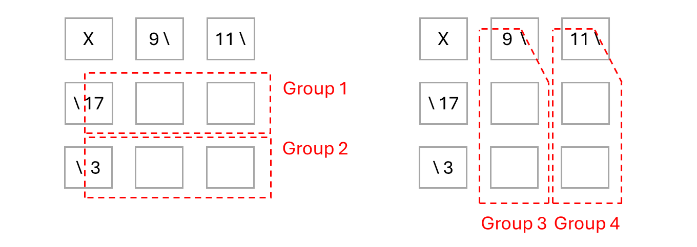

# Kakuro Solver

__Puzzle:__ [Kakuro Solver](https://www.codingame.com/training/hard/kakuro-solver)

__Author:__ [@Q12](https://www.codingame.com/profile/b683bbb0b3a4c1d61f3ac36f8201d98a6101573)

__Published Difficulty:__ Hard

__Algorithm X Complexity:__ Algorithm X Setup Is a Subset of Killer Sudoku

# Strategy

To solve Kakuro Solver, you need to do more problem space reduction than you have done for any puzzle so far. The cell groups must add up to certain numbers, but other than that, you have very little with which to work.

Consider __Example 1__ from the puzzle goal. The Kakuro grid is a 3x3 grid, but only 4 of the 9 cells need to be determined. The other 5 cells are either unused or informational. The important part of a Kakuro is how the cells are grouped together and what the sum of each group needs to be.

  

 

The next graphic summarizes all important information on the Kakuro grid in a way that resembles the cell and group approach we have used many times before.

  

 

It might be helpful to keep a copy of the original Kakuro 3x3 grid considering the output needs all elements of the 3x3 grid, including proper values for the 4 empty cells.

# Tougher Input to Parse

The input for Kakuro Solver is a bit challenging, but I encourage you to make your goal to copy what has been done on every logic puzzle so far. A dictionary is used to store pointers to all the cells of the grid and a list is used to hold pointers to all the groups.

This puzzle validates the choice of a dictionary for the grid over any type of 2-dimensional array. Why? The only important cells to put in the dictionary are cells in the Kakuro grid that are either empty or already contain a number. A number of cells in the Kakuro grid are used to tell us how to group cells and what the sum of the cells in the group must be. The information obtained from those cells is used to build the groups, but that information never changes. There is no need to store these cells in the dictionary.

1. Parse the input, creating instances of a `KakuroCell` in the `self.grid` dictionary. 

1. Parse the input again, this time looking for locations in the Kakuro input that indicate how to group the cells and the sum of each group. Create a new group with a list of pointers to the cells in the group.

# Sum of a Group of Cells?

Unlike many of the puzzles covered so far, the goal statement does not give a name to the groups of cells. The puzzle statement tells us:

>Rules:
>- All empty cells need to be filled in with digits, in such a way that all the given sums are respected.
>- You are not allowed to use the same digit more than once to obtain a given sum.

>- Cell with backslash : the required sum of the corresponding cells.
>- X\ : the vertical sum X of the cells downwards,
>- \X : the horizontal sum X of the cells to the right,
>- X\Y : the vertical sum X of the cells downwards, and the horizontal sum Y of the cells to the right.

Do you see the similarities between these groups and the cages you just explored in [Killer Sudoku Solver]( https://www.codingame.com/training/medium/killer-sudoku-solver)? What are the differences?

One difference is that in Kakuro, the groups are either a horizontal line of cells or a vertical line of cells. Although this is true, it is not meaningful. In Killer Sudoku, all cells of a cage could also be in a line vertically or horizontally.

Another difference is that in Kakuro, a single cell could be part of two different groups. Again, this is not a meaningful difference. In both puzzles, all that matters is that the cells add up to a certain value and the numbers in the group do not repeat.

__Groups in Kakuro are 100% identical to cages in Killer Sudoku.__ Hopefully you got a good start on reducing these cages. Regardless of how much cage reduction you have already implemented, my guess is you now will need more.

# Suggested Path Forward

The big-picture structure of your code can be exactly the same as what you wrote for [High-Rise Buildings]( https://www.codingame.com/training/expert/high-rise-buildings) and [Killer Sudoku Solver]( https://www.codingame.com/training/medium/killer-sudoku-solver).

* Create a dictionary of cells.
  
* Create a list of cages.

* Reduce the cell candidates using what you know must be true about the cages.

* Run Algorithm X.
  
    *	Update cells when Algorithm X selects/deselects rows.

    *	Validate cages and redirect Algorithm X as necessary.

Start by setting up Algorithm X with no problem-space reduction. A basic Algorithm X setup with requirements and actions will quickly solve the first 6 test cases assuming you properly validate all the cages. A slightly more dialed-in Algorithm X setup might solve all the first 9 test cases, but you could see a few timeout issues. A hardcore Algorithm X setup will solve the first 9 test cases without ever getting close to the time limit. To solve __Test Case 10: Test 10 (7 * 7)__, you will need to do some problem space reduction.

Spoiler Alert: What is meant by a "slightly more dialed-in" Algorithm X setup?

 
  
Cages cannot have duplicate numbers. Are you using optional requirements to make sure numbers are not duplicated in a cage? If you need to refresh your memory, go back and revisit the way Mrs. Knuth made sure instruments did not repeat on any day.

Spoiler Alert: What is meant by a "hardcore" Algorithm X setup?

 
  
Cages present significant opportunity for optional requirements to handle mutual exclusivity. Adding these me_requirements will add significant speed to Algorithm X. Is there a way to determine that placing a number in a cell makes it impossible to place another number in another cell? Remember, you are looking for knowledge that is not already captured by existing requirements, such as no duplicate numbers allowed in a cage.

# Solving Logic Puzzles Logically

Many __Kakuro__ puzzles can be solved without making any guesses. Click [here](solving-with-logic-only) to see my progress toward solving as many logic puzzles as possible, strictly with logic, no guessing.
