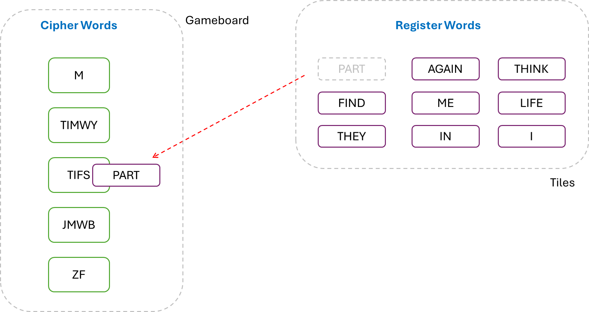
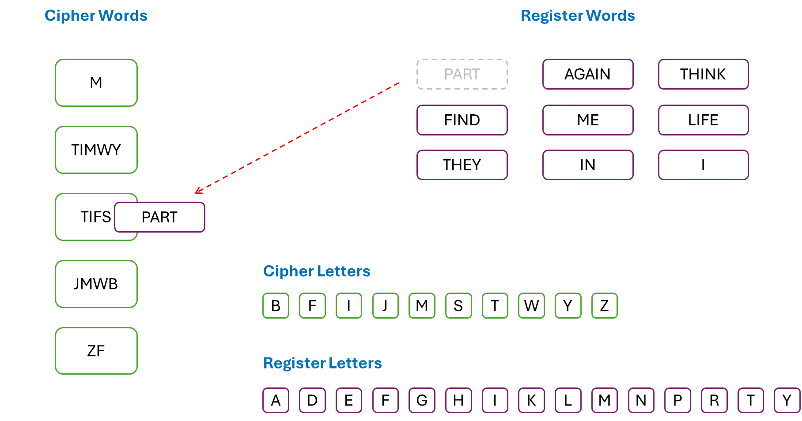
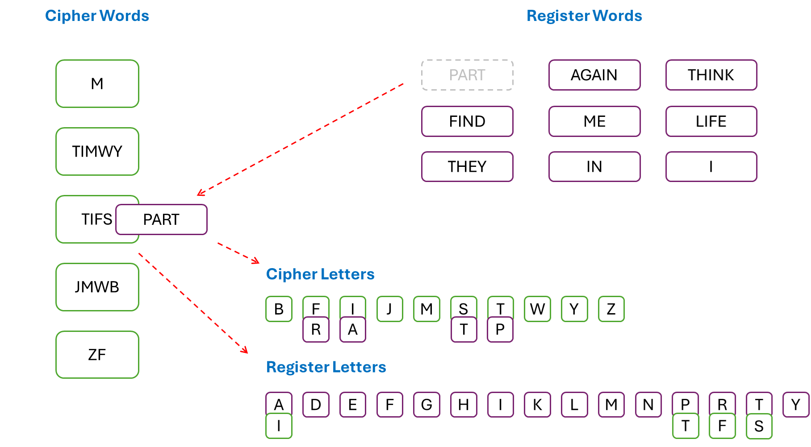

# Agent X, Mission 2 — Mysterious Cryptogram

__Puzzle:__ [Agent X, Mission 2 — Mysterious Cryptogram](https://www.codingame.com/training/medium/agent-x-mission-2mysterious-cryptogram)

__Author:__ [@Jnath](https://www.codingame.com/profile/4289b96dddd132fde4a14cf6f9c10bf22718561)

__Published Difficulty:__ Medium

__Algorithm X Complexity:__ Very Hard or Not Too Bad, Your Choice

# Strategy

Let’s begin with an excerpt from the puzzle statement:

>Your objective is to use a register of N words and a message (ciphertext), encrypted with a substitution table that you don't know, to find the decrypted message (plaintext) and part of the substitution table.
>Not every word in the register is in the message, but all words in the message are in the register.

For clarity, let’s assume the ciphertext has been parsed into a set of unique cipher words, leaving us with a list of cipher words and list of register words. Secondly, let’s assume sets of occurring letters have been compiled giving us a set of all cipher letters and a set of all register letters. I am using the term “letters” instead of “characters” because the problem states “substituted characters are only letters”.

The following are easily pulled from the above statements:

* Requirements: Every cipher word must be mapped to exactly one register word.

* Optional Requirements: Each register word might remain unused or it may be mapped to exactly one cipher word.

Ultimately, mapping the register words to the cipher words results in a substitution matrix that maps cipher letters to register letters. It is tempting to say:

* Requirements: Every cipher letter must be mapped to exactly one register letter.

* Optional Requirements: Each register letter might remain unused or it might be mapped to exactly one cipher letter.

# Avoid The Temptation!

Although both statements above are accurate, taking a step back and looking at the tiles and the gameboard is helpful here. The gameboard is nothing more than a list of cipher words. The tiles are the register words. One-by-one, tiles are placed on the gameboard, but each tile covers several of the “letter requirements” depending on  the number of letters in the word. When you consider how many tiles a single letter might appear on, it becomes clear that the letter requirements above might be candidates for coloring.

After all mappings are complete, both letter-mapping requirements above are true, but during the process of placing tiles on the gameboard, each letter requirement could be covered many times. To find a proper solution, all the _colorings_ across every _covering_ must be consistent.

Remember, the Algorithm X matrix is binary data. Requirements that can be covered many times do not fit into the binary mold. In the multiplicity section of this playground, we discussed a strategy for requirements that must be covered a certain number of times. Now, we have have a new category of requirements that can be covered an arbitrary number of times and the way they are covered (the color applied to the requirement) must be consistent.

# Tiles on a Gameboard

Consider the following gameboard visual for the __Example Test Case__, which shows a group of cipher words and a group of register words. Each action takes a register word and tries matching it to a cipher word of equal length.

 

 

It appears everything needed is on the gameboard, but with these types of problems, it is often necessary to look at the gameboard from a different perspective. The next diagram contains a second view of the gameboard. A set of letters found across the cipher words and a set of letters found across the register words has been added.

 

 

The next diagram shows the full effect of matching one register word to one cipher word. Each time a word pair is created, the letters of each word need to be dropped on their counterparts in the bottom right. The next cipher-word-register-word pair can drop letters on letters that have not been colored with a counterpart letter, but if the counterpart already has a tile present, the new letter tile must match.

 

 

# Consistency Is Key

It can be challenging to visualize an Exact Cover problem that requires coloring. In the previous diagrams, think of the two sets of letters in the bottom right as the __Color Police__. When the gameboard is first considered, these groups are often not obvious, but at some point in the gameboard exploration, a need for consistency arises. This need is a telltale sign, it is time to consider adding the Color Police to your gameboard.

# Setting Up Your Solver

If you love repeatability, take a break from your work right now. Get up, open a window and yell for all the world to hear, 

 

| 🔥🔥🔥  I LOVE REPEATABILITY!  🔥🔥🔥|
|:-------:|

 

To set up your solver, follow the exact instructions presented [just a few short pages ago](coloring-with-your-solver). Of course, you will need to handle two distinct sets of letters. You might choose to keep it simple and add two attributes to your solver or you might wish to be clever and implement the color police with a single `dictionary`.

# Minor Spoiler

I was able to speed up my solution by doing this...

 

Because significant attention is paid to the cipher letters and the register letters, the optional requirements end up being excess baggage for Algorithm X. They are completely legitimate and there is nothing wrong with leaving them where they are, but you may want to compare run times with and without them. In many puzzles, removing legitimate requirements is not a good idea, but in a situation like this, the word requirements and the letter requirements have some overlap that allows for the optional requirements to be omitted.

