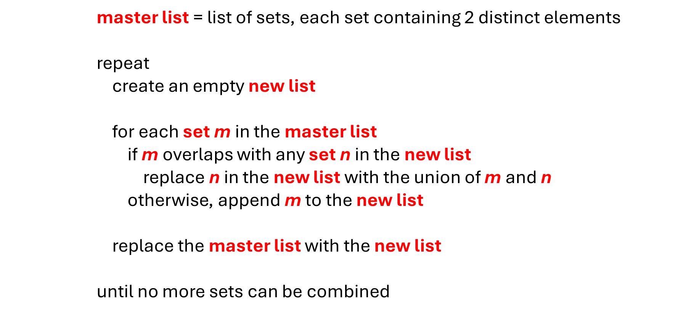

# Reducing Sets of Events

The Scavenger Hunt made it easy to identify the all-or-none sets of events as the children were simply grouped by last name. It is more common to have many sets of events that contain only 2 elements and it is up to you to combine the sets where possible and build a minimum number of completely independent sets. Let’s explore a short algorithm for doing that.

In the realm of sameness, there are two fundamental building blocks. The first is a single standalone item. The second is two items that need to be the same. For instance, `A` must be the same as `B`. Given a list of sets, where each set contains a single element or 2 elements that must be the same, the following pseudocode reduces that list to a minimum number of sets, where no 2 sets have any overlap.

<BR><BR>

<BR>

# Test Your Skills

The following exercise gives you a chance to practice reducing a list of sets that might have overlap to a list of sets where no two sets overlap with each other. The number of distinct elements does not change, but any two sets that have overlap must be combined, resulting in a shorter list of all-or-none sets. Each set in the final list contains a group of elements that all must be the same in some way.

__Input:__ You are given a `list` of `set`s and each `set` contains one or two single character `str`ings.  For instance:

```python
[{'A', 'B'}, {'B', 'C'}, {'C', 'D'}, {'E', 'F'}, {'A'}, {'Z'}]
```

__Output:__ You must return a `list` of `list`s, `set`s or `tuple`s with the sets combined wherever possible. Order is not important for any part of the required output. For instance, the following would all be considered correct for the above input. 

```python
[{'A', 'B', 'C', 'D'}, {'E', 'F'}, {'Z'}]
[['A', 'B', 'C', 'D'], ['E', 'F'], ['Z']]
[('A', 'B', 'C', 'D'), ('E', 'F'), ('Z',)]

# other arrangements of the lists or tuples are also valid, such as:
[('F', 'E'), ('Z',), ('C', 'B', 'A', 'D')]
```

@[Minimize the list of all-or-none sets of events.]({"stubs": ["all_or_none.py"], "command": "python3 all_or_none_test.py"})
