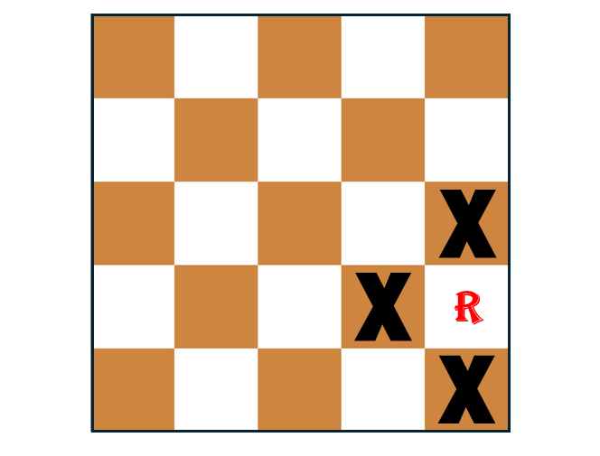
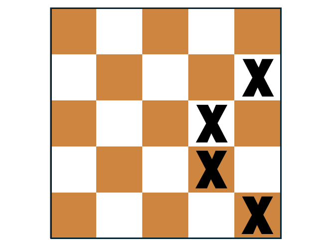

# Harmless Rooks (cont.)

Harmless Rooks fits the same cells and groups model used on many of the previous puzzles. Each open `Square` on the board has a relationship with exactly 2  `AttackLine`s and each `AttackLine` has a relationship with 1 or more `Square`s.

 

 

A `Square` is uniquely identified by its `row` and `col`, but it is a bit more challenging to uniquely identify an `AttackLine`. In the class diagram above, I have added an integer `id` for each `AttackLine`. Each class also has a `reduce_()` method as seen in many puzzles before.

# Problem-Space Reduction

What does it mean to reduce a `Square` or an `AttackLine`? Somehow, we need to shrink the size of the larger boards by placing rooks logically. Consider the following diagram where three `X` locations isolate a single `Square`:

 

 

Obviously, a rook can be placed on the isolated `Square`. Placing a rook in that location does not change what is possible with the rest of the board. Now, consider the following diagram where four `X` locations isolate a group of two `Squares`:

 

 

Placing a rook on either `Square` in the isolated area will eliminate 3 `AttackLine`s from the game, the two covered by the rook and the second `AttackLine` covered by the other location that is now ineligible for a rook. In this case, placing a rook on each `Square` does the same amount of _damage_ to the board as far as placing more future rooks. Because these two `Square`s are isolated and neither causes more damage than the other, a rook can be placed on either `Square`, eliminating the other `Square` from consideration.

Every time you find a location where a rook can be placed logically, `AttackLine`s and `Square`s are eliminated from future consideration. This process shrinks the size of the problem since Algorithm X only needs to know about `AttackLine`s and `Square`s that must be considered to determine the maximum rook placements going forward.

# On to the Puzzle

To solve this puzzle with the Algorithm X implementation discussed in the previous pages, you mst figure out ways to place many more rooks logically. We already handicapped Algorithm X by customizing it to be inefficient. The boards it can solve need to be a lot smaller than the large test cases.

Algorithm X might not be the best solution to this puzzle, but this is a hard puzzle and any solution is commendable. Getting an Algorithm X-based solution up and running quickly, that solves the boards once they are reduced enough, provides a feedback system that might be exactly what you need to persevere and solve all test cases.

