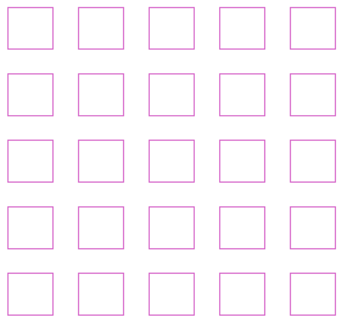
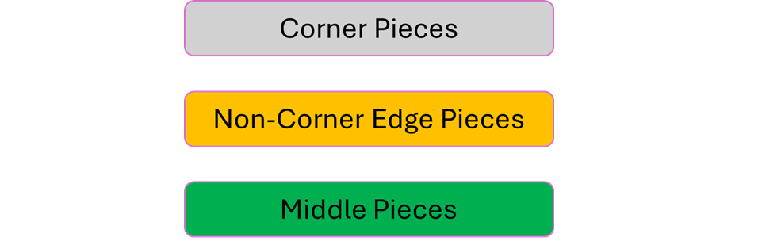

# Picture Puzzle?

__Puzzle:__ [Picture Puzzle](https://www.codingame.com/training/hard/picture-puzzle)

__Author:__ [@Teiglin](https://www.codingame.com/profile/a2479be594111a93820fb21d274e6d710281544)

__Published Difficulty:__ Hard

__Algorithm X Complexity:__ Eliminating Invalid Actions Keeps Algorithm X Complexity Reasonable

# Strategy

I was an original reviewer of this puzzle submission in February, 2023. At that time, I was fairly new to Algorithm X and seeing the puzzle as an exact cover never crossed my mind. Recently, [@VizGhar](https://www.codingame.com/profile/c152bee9fe8dc90ac4f6b84505b59ebb9086993) asked if the [Eternity II](https://en.wikipedia.org/wiki/Eternity_II_puzzle) puzzle could be solved with Algorithm X. Thinking about this question led me to revisit this puzzle.

The tiles on a gameboard analogy for this puzzle is straightforward. The tiles are the puzzle pieces (could it really be that simple?) and the gameboard is a grid of locations where the puzzle pieces must be placed. A basic Algorithm X setup will quickly solve all test cases except __Test Case 2__ and __Test Case 6__.

Although I called it a "basic" Algorithm X setup, enumerating all possible actions is challenging. Still, I believe getting Algorithm X to work as specified above is a strong approach. To solve __Test Case 2__ and __Test Case 6__ requires some problem-space reduction.

Because I found the problem-space reduction for this puzzle so enjoyable, I am going to share my approach here. Before clicking, give it a try on your own. I learned a lot comparing my original approach to my new approach that has been <u>heavily</u> influenced by this playground.

Spoiler Alert: Do not click unless you have tried it yourself!

  
Is this Picture Puzzle really much different than a [Sudoku](problem-space-reduction-2)? The pieces need to be properly placed on a grid of locations I call `PuzzleCell`s. Let’s assume we have a 5x5 puzzle to solve. The basic puzzle grid is shown in the next figure. Just like in Sudoku, I put space between each `PuzzleCell`. My reasons for doing this will be revealed shortly.

 

 

Before digging deeper into the gameboard, consider the pieces for a moment. When doing a picture puzzle on your kitchen table, you might first sort the pieces into the three groups shown below.

 

 

Corner pieces have 2 puzzle borders, non-corner edge pieces have a single puzzle border and middle pieces have no puzzle borders. This initial sorting already limits the candidates for each cell. In the following diagram, the color of each cell corresponds to the group of pieces that make up the cell’s initial candidates.

 

 

Does this mean there are only 4 candidates for each corner piece? Yes, it does, but that is a bit misleading. A puzzle piece alone is not enough to properly distinguish one candidate from another in the middle of the puzzle. On the corners and edges, the puzzle border limits each puzzle piece to a single possible rotation. Middle pieces are different. 

In the middle of the puzzle, each piece might look different when rotated. Each unique rotation is a distinct candidate. In the 5x5 puzzle above, there are 9 middle pieces, meaning each location has up to 36 possible candidates. (Exercise for the reader: Why did I say “up to”?)

In the next figure, the blue rectangles represent the puzzle border.

 

 

These borders are interesting because they too have candidates. I have intentionally spaced out the blue rectangles to make them align with their adjacent pieces. The middle pieces also have interesting borders. Adding all the piece borders to the diagram results in:

 

 

Why are these borders interesting? Each border has a set of possible values. Look at the edge pieces first. Each edge piece border, adjacent to the puzzle border, only has a single possible value. Keeping track of possible values for every blue border is critical to reducing the candidates for each cell.

Consider the corner cell in the top left corner. At most, that cell has only 4 candidates: each of the four corner pieces, properly rotated to align the borders to match the left and top borders that only have one possible value. Using these four candidates, the possible values of the bottom and right borders (of cell `(0, 0)`) can be determined.

Now move to the cell in `(row 0, column 1)`. The top border is limited to the puzzle border. The left border has limited possibilities that were just determined. It is now easy to loop through the candidates for this cell `(0, 1)` and eliminate candidates that violate the border possibilities. From the remaining candidates, the possibilities for the 4 borders of cell `(0, 1)` may be updated appropriately.

I then use the exact same reducing loop, discussed many times in this playground, to loop through the rows and columns of the grid over and over until a full pass through the grid does not produce any changes.

At this point, all cells will be reduced to a single candidate for __Test Cases 1 – 3 and 5 – 7__. I will leave it to you to figure out why __Test Case 4__ and __Test Case 8__ cannot be reduced all the way to a single candidate per cell (unless you add a tiny bit more logic).

# A Bit About Solution Design

In the next diagram, I have grey out either the horizontal borders or the vertical borders.

 

 

These figures make it easy to see we have a 6 x 5 array of horizontal borders and a 5 x 6 array of vertical borders. Ultimately every cell needs to know about 4 borders, the top, bottom, left and right. Using the perspective seen in the figure above makes it easy to assign borders to a cell based on that cell’s row and column.

Secondly, it appears the following classes might be helpful in a solution design: `PuzzlePiece`, `PicturePuzzle`, `PuzzleCell` and `Border`.  From an analysis point of view, I agree 100%. From a design perspective, there is nothing interesting about a `Border` other than the _set_ of possible values that could be placed in that location. Although I could create a separate `Border` class, Python’s `Set` class does everything I could want a `Border` class to do.

It is still important to create the matrix of horizontal borders and the matrix of vertical borders to hold all the sets. These matrixes make it easy to give each cell 4 pointers, each pointing to one of its four borders.

# Observations

At first glance, I would never expect this much overlap between a picture puzzle and a Sudoku. I am happy with my original solution to this puzzle, but I am thrilled with my new approach. It is no secret that I love repeatability and seeing how similar my new solution is to every solution I built for the logic puzzles covered earlier makes my new approach significantly more powerful in my eyes.

