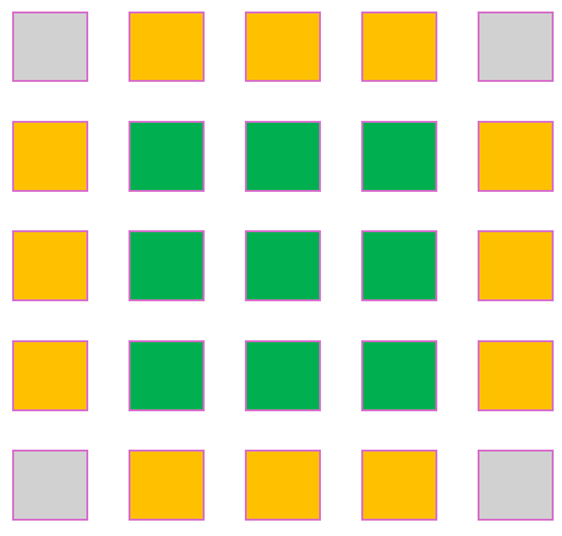

# Picture Puzzle?

__Puzzle:__ [Picture Puzzle](https://www.codingame.com/training/hard/picture-puzzle)

__Author:__ [@Teiglin](https://www.codingame.com/profile/a2479be594111a93820fb21d274e6d710281544)

__Published Difficulty:__ Hard

__Algorithm X Complexity:__ Eliminating Invalid Actions Keeps Algorithm X Complexity Reasonable

# Strategy

I was an original reviewer of this puzzle submission in February, 2023. At that time, I was fairly new to Algorithm X and seeing the puzzle as an exact cover never crossed my mind. Recently, [@VizGhar](https://www.codingame.com/profile/c152bee9fe8dc90ac4f6b84505b59ebb9086993) asked if the [Eternity II](https://en.wikipedia.org/wiki/Eternity_II_puzzle) puzzle could be solved with Algorithm X. Thinking about this question led me to revisit this puzzle.

The tiles on a gameboard analogy for this puzzle is straightforward. The tiles are the puzzle pieces (could it really be that simple?) and the gameboard is a grid of locations where the puzzle pieces must be placed. A basic Algorithm X setup will quickly solve all test cases except __Test Case 2__ and __Test Case 6__.

Although I called it a "basic" Algorithm X setup, enumerating all possible actions is challenging. Still, I believe getting Algorithm X to work as specified above is a strong approach. To solve __Test Case 2__ and __Test Case 6__ requires some problem-space reduction.

Because I found the problem-space reduction for this puzzle so enjoyable, I am going to share my approach here. Before clicking, give it a try on your own. I learned a lot comparing my original approach to my new approach that has been <u>heavily</u> influenced by this playground.

Spoiler Alert: Do not click unless you have tried it yourself!

  
The grid...

 

 

The piece types...

 

 

The cell candidates...

 

 

The puzzle border...

 

 

 

 

 

 

