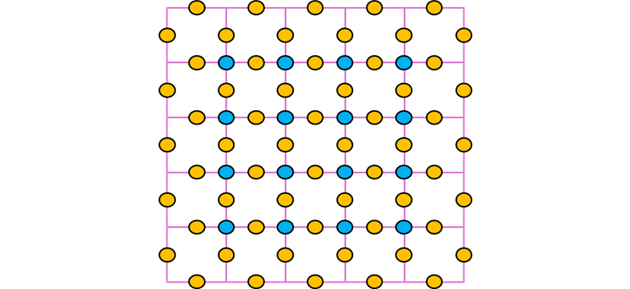
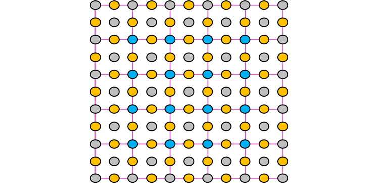

# Tetrasticks

__Puzzle:__ Tetrasticks - COMING SOON

__Author:__ [@VizGhar](https://www.codingame.com/profile/c152bee9fe8dc90ac4f6b84505b59ebb9086993)

__Published Difficulty:__ Medium

__Algorithm X Complexity:__ Textbook _Generalized_ Exact Cover

# Strategy

On the previous page, I mentioned Donald Knuth’s Dancing Links paper on [arXiv.org]( https://arxiv.org/abs/cs/0011047). In that paper, Knuth also covers tetrasticks and I highly recommend studying his approach. Tetrasticks exist on the edges of cells and distinguishing horizontal edges from vertical edges requires great attention to detail, especially when considering various rotations of the game pieces.

Rather than rehashing Knuth’s material, I will cover an alternate approach to this puzzle. Being cell-based, important information in polyominoes is easily captured in a 2-dimensional array. Piece rotations and placement options are not overly complicated. Using a perspective shift, a tetrasticks puzzle can be translated to an _almost_ equivalent polyominoes puzzle and easily solved with minimal changes you already wrote for [Polyominoes](polyominoes). I will come back to my use of the word “almost”.

Consider a 5x5 gameboard. The tetrasticks need to cover all the cell edges. These edges include a 6x5 matrix of horizontal edges and a 5x6 matrix of vertical edges. Just as I suggested in [Picture Puzzle](picture-puzzle), it appears separate data structures might be necessary to organize the horizontal edges and the vertical edges.

Tetrasticks is an edge-based puzzle while Polyominoes is a cell-based puzzle. Converting tetrasticks to cell-based requires a finer level of detail and to capture more detail requires a larger 2-dimensional array. To illustrate this concept, first consider the following 5x5 grid that needs to be covered with tetrasticks.

  

 

Each edge of the grid is important. In the next diagram, I have placed a orange dot on every edge, essentially overlapping the 6x5 grid of horizontal edges and the 5x6 grid of vertical edges.

  

 

The interior intersections of the grid are also important in that no two tetrasticks can cross each other at these locations. In the following diagram, I have added blue dots on all interior intersections, each of which could be an integral part of a proper solution.

  

 

The exterior intersections of the grid and the cells themselves are never important to a tetrasticks solution. In the next diagram, I have covered each cell and each exterior intersection with a grey dot.

  

 

This 11x11 matrix provides the __resolution__ necessary to capture all the interesting features of a tetrasticks puzzle. The edges of the cells are no longer important. The edges and every edge intersection of the original puzzle are now represented by cells.

In the following diagram, I have replaced each dot with a cell in a 2-dimmensional matrix. Each white cell is an edge from the original puzzle. Each grey cell is either an edge intersection from the original puzzle or one of the cells in the original puzzle. For clarity, I have smudged the 25 grey cells that made up the original tetrasticks puzzle.

  

 

  

 
