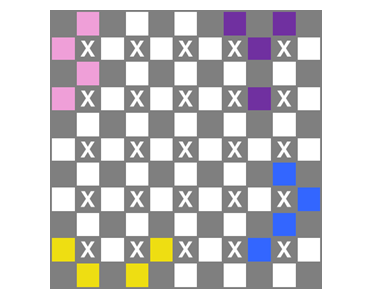

# Tetrasticks

__Puzzle:__ Tetrasticks - [Awaiting Approval - See CG Contribution Page](https://www.codingame.com/contribute/community)

__Author:__ [@VizGhar](https://www.codingame.com/profile/c152bee9fe8dc90ac4f6b84505b59ebb9086993)

__Published Difficulty:__ Medium

__Algorithm X Complexity:__ Textbook _Generalized_ Exact Cover

# Strategy

In the previous [polyominoes](polyominoes) discussion, I mentioned Donald Knuth’s Dancing Links paper on [arXiv.org]( https://arxiv.org/abs/cs/0011047). In that paper, Knuth also covers tetrasticks and I highly recommend studying his approach. Tetrasticks exist on the edges of cells and distinguishing horizontal edges from vertical edges requires great attention to detail, especially when considering various rotations of the game pieces.

Rather than rehashing Knuth’s material, I will cover an alternate approach, translating a 5x5 tetrasticks puzzle into an _almost_ equivalent 11x11 polyominoes puzzle. Polyominoes is easily represented with a 2-dimensional array where piece rotations and placement options are not overly complicated. A proper translation is challenging, but you should be able to reuse your polyominoes code with minimal changes.

# Hey Google, Translate My Puzzle

Tetrasticks are made of connected edges of a grid. Polyominoes are made of connected cells of a grid. To represent tetrasticks as polyominoes, we need a finer grid resolution that captures every original edge as a cell unit. Consider the following 5x5 tetrasticks gameboard.

  

 

Each edge of the grid is important. In the next diagram, I have placed a orange dot on every edge, overlapping the 6x5 grid of horizontal edges and the 5x6 grid of vertical edges.

  

 

Edge intersections are sometimes important because no two tetrasticks can cross each other. In the following diagram, I have added blue dots on _all_ edge intersections, many of which could be an integral part of a proper solution.

  

 

The cells themselves are not important to a tetrasticks solution, but adding a dot on each cell perfectly fills in the 2-dimensional matrix. In the next diagram, I have covered each cell with a grey dot.

  

 

This 11x11 matrix provides the __resolution__ necessary to capture all the interesting features of a tetrasticks puzzle. Cell edges are no longer important. The edges and every edge intersection of the original puzzle are now represented by cells.

In the next diagram, I have replaced each dot with a cell in a 2-dimensional grid. Each white cell is an edge from the original puzzle. Each grey cell is either an edge intersection from the original puzzle or one of the cells in the original puzzle. For clarity, I have added a white `X` to the 25 cells that made up the original 5x5 tetrasticks puzzle.

  

 

Each cell with an `X` has 4 empty neighbors, the cell’s original 4 edges that need to be covered by a tetrastick. With this new resolution, the puzzle transforms into finding a way to exactly cover the white cells, but what do the translated tetrasticks look like now?

In this last diagram, I have put an `F` in the upper left corner, a `T`in the upper right corner, a `U` in the bottom left corner and a `P` in the bottom right corner. Each tetrastick is now a group of cells in the translated grid.

  

 

# Final Steps

The grid translation has taken shape, but you still need to translate the tetrasticks. In the problem statement, @VizGhar uses the words _bounding box_, referring to the smallest rectangle that completely contains each tetrastick. Translating each bounding box is the key to properly translating each tetrastick to an equivalent polyomino. Of course, you also need to create a way to identify the tetrastick joints that could be problematic.

I began working on this puzzle before finishing polyominoes which allowed me to put some thought into writing code that could be used by both puzzles. Other than my translation code, I only had to add two lines of code to my `PolyominoesSolver`, one line to build the `optional_requirements` and a second line to add the appropriate `optional_requirements` to each action's covered requirements.

# Translations in General

Just like one language can be translated to many other languages, the translation I cover above is not the only way to translate tetrasticks (or any other puzzle) to something more familiar. The important part of a translation is that it simplifies your task. For me, working with the horizontal edges and the vertical edges felt a bit overwhelming. Once I went down the translation path, I was able to build on top of the polyominoes concepts with which I had already become comfortable.
