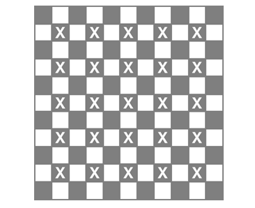

# Tetrasticks

__Puzzle:__ Tetrasticks - COMING SOON

__Author:__ [@VizGhar](https://www.codingame.com/profile/c152bee9fe8dc90ac4f6b84505b59ebb9086993)

__Published Difficulty:__ Medium

__Algorithm X Complexity:__ Textbook _Generalized_ Exact Cover

# Strategy

In my [Polyominoes](polyominoes) discussion, I mentioned Donald Knuth’s Dancing Links paper on [arXiv.org]( https://arxiv.org/abs/cs/0011047). In that paper, Knuth also covers tetrasticks and I highly recommend studying his approach. Tetrasticks exist on the edges of cells and distinguishing horizontal edges from vertical edges requires great attention to detail, especially when considering various rotations of the game pieces.

Rather than rehashing Knuth’s material, I will cover an alternate approach, translating a 5x5 tetrasticks puzzle into an _almost_ equivalent 11x11 polyominoes puzzle. Polyominoes is easily represented with a 2-dimensional array where piece rotations and placement options are not overly complicated. A proper translation is challenging, but you should be able to reuse your Polyominoes code with minimal changes.

Tetrasticks are made of connected edges of a grid. Polyominoes are made of connected cells of a grid. To represent tetrasticks as polyominoes, we need a finer resolution that captures every original edge as a cell unit. Consider the following 5x5 tetrasticks gameboard.

  

 

Each edge of the grid is important. In the next diagram, I have placed a orange dot on every edge, essentially overlapping the 6x5 grid of horizontal edges and the 5x6 grid of vertical edges.

  

 

The interior intersections of the grid are also important in that no two tetrasticks can cross each other at these locations. In the following diagram, I have added blue dots on all interior intersections, each of which could be an integral part of a proper solution.

  

 

The exterior intersections of the grid and the cells themselves are never important to a tetrasticks solution. In the next diagram, I have covered each cell and each exterior intersection with a grey dot.

  

 

This 11x11 matrix provides the __resolution__ necessary to capture all the interesting features of a tetrasticks puzzle. The edges of the cells are no longer important. The edges and every edge intersection of the original puzzle are now represented by cells.

In the following diagram, I have replaced each dot with a cell in a 2-dimmensional matrix. Each white cell is an edge from the original puzzle. Each grey cell is either an edge intersection from the original puzzle or one of the cells in the original puzzle. For clarity, I have smudged the 25 grey cells that made up the original tetrasticks puzzle.

  

 

Each smudged cell has 4 empty neighbors, the cell’s original 4 edges that need to be covered by a tetrastick. With this new resolution, the puzzle becomes finding a way to exactly cover the white cells, but what do the translated tetrasticks look like now?

In the following diagram, I have put an `F` in the upper left corner, a `T`in the upper right corner, a `U` in the bottom left corner and a `P` in the bottom right corner. Each tetrastick is now a group of cells in the translated grid.

  

 
