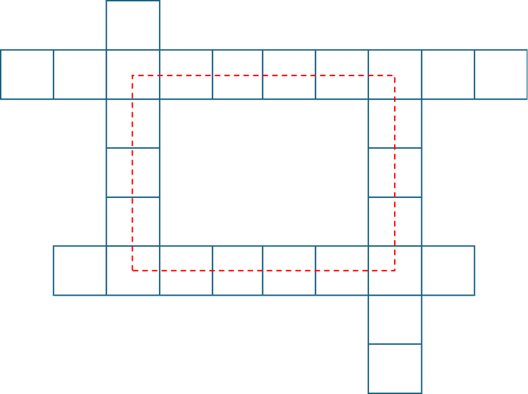

# Crossword

__Puzzle:__ [Crossword](https://www.codingame.com/training/medium/crossword)

__Author:__ [@Humanosaure](https://www.codingame.com/profile/5bbc0f4b299d3bb28410b96df8a45b607624692)

__Published Difficulty:__ Medium

__Algorithm X Complexity:__ Uniqueness Provides a Challenge

# Overview

Given two horizontal words and two vertical words, this puzzle challenges us to determine whether a valid crossword puzzle can be constructed such that all four words intersect pairwise. In the diagram below, each word's letters have been omitted, but it is easy to imagine how a properly constructed grid might appear.

  

 

To make things slightly more challenging, the author adds an extra twist: we are required to print the solved crossword grid when there is exactly one valid solution. Whether or not you use Algorithm X, constructing the grid is no easy feat — even when you already know where the four words must go!

I found it particularly interesting to frame this puzzle as an exact cover problem. This unique perspective opens the door to some elegant strategies, which I’ll explore in more detail below. But before diving into those details, I strongly encourage you to try solving the puzzle on your own. There are several compelling ways to approach it as an exact cover, and I believe you will find the experience both rewarding and enjoyable.

Spoiler Alert: There is no way to go back.

# Important Details

The first thing to notice about this puzzle is that all valid solutions form a __"box"__, as illustrated in the diagram below. Each box can be as small as 3×3, or as large as `min(h1 length, h2 length) × min(v1 length, v2 length)`. Regardless of its size, the box always plays a central role.

  

 

From the perspective of tiles on a gameboard, each solution consists of just four actions: placing one word across the top, a second across the bottom, a third down the left side, and a fourth down the right. Simple, right? But is it enough to just match four words to four sides? No, it is not.

Although the exact size of the box is not known upfront, placing a word on the gameboard must also specify which letters of the word go on the corners of the box. The box is part of the gameboard, but its size is determined by how words are placed—specifically, which letters are used at the corners.

In every exact cover problem we have seen so far, a solution was built from a list of actions. To build a solution for this puzzle, each action must now include four key pieces of information: the word being placed, the side it is being placed on, and the indexes of the two letters that land on the box’s corners. An action might look like this:

`('place word', word, side, i, j)`

With this richer action format, valid solutions can be built from just 4 actions. Care must be taken to ensure:

* The same letter appears at each corner where sides intersect.
* Because the box is always a rectangle, the words on opposite sides must have the same distance between their respective corner letters (i.e., the same difference between `i` and `j`).

Hopefully, you see the sameness that must be enforced. Let’s explore how that plays out — using coloring versus mutual exclusivity.

# Enforcing Sameness with Coloring

In the diagram below, each corner is labeled with a unique integer ID, and two key dimensions are highlighted: the __box width__ and __box height__. Each action specifies letters that occupy two corners, and those corners, in turn, define either the width or the height of the box.

Although only six requirements need to be colored, maintaining consistency across those colors is what guarantees valid solutions.

  

 

Each of these six requirements is colored exactly twice, creating a structure that is highly conducive to usuing mutual exclusivity.

# Enforcing Sameness with Mutual Exclusivity

Whenever possible, I prefer mutual exclusivity over coloring. Mutual exclusivity is a natural fit within Algorithm X, while my coloring approach is a custom adaptation that adds useful power — but at a cost.

In the next diagram, I’ve split each corner into two types of coverage: vertical and horizontal. I’ve also labeled the lengths of all four sides of the box. Because each corner must be covered consistently, a set of `me_requirements` can be created to enforce that consistency. For example, corner `1` being covered `horizontally` with an `s` is mutually exclusive with the same corner being covered `vertically` with a `g`.

This technique also applies to the box sides. For instance, the `Top` having a length of `3` is mutually exclusive with the `Bottom` having a length of `4`.

  

 

There is a fair amount of optimization that can be done when identifying requirements for mutual exclusivity. Only certain letters are valid for each corner in each direction, and only certain lengths are legitimate for each side. Keeping your list of `me_requirements` as small and focused as possible is crucial if you want to maximize speed and efficiency.

