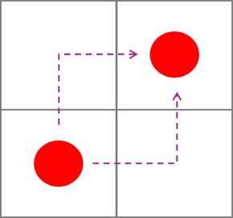
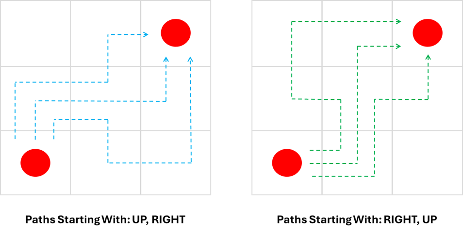
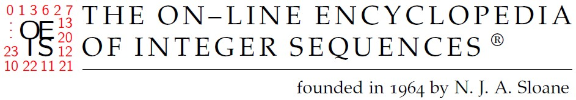

# Connect the Colours

__Puzzle:__ Connect the Colours - Coming Soon

__Author:__ [@Harry.B.](https://www.codingame.com/profile/d926a93cb394ded661b204822965c5fa7122915)

__Published Difficulty:__ Hard

__Algorithm X Complexity:__ Textbook Algorithm X, Challenging Optimization

# Overview

This puzzle, crafted by @Harry.B., is a stellar example of a visual exact-cover problem using the CodinGame SDK. It earns two thumbs up for its engaging design! To succeed, you’ll need sharp grid-navigation skills to generate all possible paths between pairs of same-colored endpoints. Once you’ve mastered path generation, Algorithm X can efficiently find solutions for many test cases. However, completing all test cases demands careful optimization due to the explosive growth of possible paths.

Let’s dive into what fuels the "volcanic eruption" of paths in this challenge.

# Understanding Paths in a 2x2 Grid

  

 

Consider a simple 2x2 grid with one pair of red endpoints, from the bottom-left corner to the top-right corner. There are exactly two distinct paths connecting these points. These are known as **nonintersecting (self-avoiding) rook paths**, adhering to two key rules:

1. A path cannot intersect itself.

1. Movement is restricted to horizontal and vertical steps, mimicking a rook’s moves in chess (up, down, left, or right).

# Scaling to a 3x3 Grid

Now, let’s examine a 3x3 grid. To simplify, consider the possible paths after the first two moves from the bottom-left to the top-right corner. There are four possible combinations of initial moves as shown below.

  

 

  

 

After the initial two steps, each path branches into three additional options. This results in __12 possible paths__ for a 3x3 grid.

This number may seem manageable, but the complexity escalates quickly with larger grids. Using a depth-first search in Python, I calculated the number of possible self-avoiding rook paths for larger grids:

* 4x4: 184 paths

* 5x5: 8,512 paths

* 6x6: 1,262,816 paths

* 7x7: 575,780,564 paths

Computing the paths for a 7x7 grid took my laptop over an hour, revealing the sheer scale of this problem. My approach was naïve, and the complexity of this challenge opened my eyes to the depth of research on self-avoiding paths. I eventually stumbled upon the Online Encyclopedia of Integer Sequences ([OEIS](https://oeis.org/wiki/Main_Page)), where I found data up to `n==27` and I also found...the fingerprints of, none other than, Donald Knuth.

# Just Can't Get Enough

In 1981, pioneering English electronic band Depeche Mode released their debut album _Speak & Spell_, featuring their first Top 10 hit, _Just Can’t Get Enough_. The lyrics seem to tell the story of a romantic obsession — but a tongue-in-cheek theory holds that it’s really about the band’s deep, unshakable love for integer sequences.

  

 

Seventeen years earlier, in 1964 — long before synthesizers were filling dance floors — mathematician Neil J. A. Sloane began compiling collections of these integer sequences. His work eventually grew into two printed books (1973 and 1995) and later evolved into an email service and, in 1996, a public website. Today, the Online Encyclopedia of Integer Sequences ([OEIS](https://oeis.org/wiki/Main_Page)) is home to 386,574 sequences (as of August 2025) — more than enough to ensure that even a synth-pop mathematician just can’t get enough.

[Topic A007764](https://oeis.org/A007764) on the OEIS has all the information you need if you'd like to search for the next number in the sequence. The topic was originally authored by David Radcliffe and Donald Knuth. In the next table, I have included the number of rook paths for `n=1` to `n=14`.

|n|Number of Rook Paths|
|:---:|:---|
|1|1|
|2|2|
|3|12|
|4|184|
|5|8,512|
|6|1,262,816|
|7|575,780,564|
|8|789,360,053,252|
|9|3,266,598,486,981,642|
|10|41,044,208,702,632,496,804|
|11|1,568,758,030,464,750,013,214,100|
|12|182,413,291,514,248,049,241,470,885,236|
|13|64,528,039,343,270,018,963,357,185,158,482,118|
|14|69,450,664,761,521,361,664,274,701,548,907,358,996,488|

Do you need more? Click [here](https://oeis.org/A007764/b007764.txt) to see the full list for `n=1` to `n=27`.

# Now That's Big

The number of rook paths for `n=27` contains 164 digits! The science news website, Live Science, estimates there are [$10^{82}$ atoms in the observable universe](https://www.livescience.com/how-many-atoms-in-universe.html). To get to $10^{64}$, __we have to give every one of those atoms its own full universe!__

This leaves me with two research questions on my to-do list:

1. How do I calculate something that big?

2. How do I prove to my friends that my calculation is accurate!

# h/t Depeche Mode

https://www.youtube.com/watch?v=5WHcjGFihck
