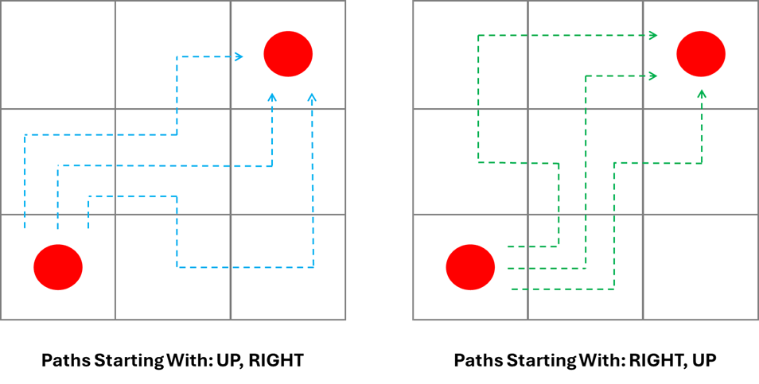

# Connect the Colours

__Puzzle:__ Connect the Colours - Coming Soon

__Author:__ [@Harry.B.](https://www.codingame.com/profile/d926a93cb394ded661b204822965c5fa7122915)

__Published Difficulty:__ Hard

__Algorithm X Complexity:__ Textbook Algorithm X, Difficult Optimization

# Overview

  

 

# Important Details

  

 

  

 

# Just Can't Get Enough

In 1981, pioneering English electronic band Depeche Mode released their debut album _Speak & Spell_, featuring their first Top 10 hit, _Just Can’t Get Enough_. The lyrics seem to tell the story of a romantic obsession — but a tongue-in-cheek theory holds that it’s really about the band’s deep, unshakable love for integer sequences.

  

 

Seventeen years earlier, in 1964 — long before synthesizers were filling dance floors — mathematician Neil J. A. Sloane began compiling collections of these integer sequences. His work eventually grew into two printed books (1973 and 1995) and later evolved into an email service and, in 1996, a public website. Today, the [Online Encyclopedia of Integer Sequences (OEIS)](https://oeis.org/wiki/Main_Page) is home to 386,574 sequences as of August 2025 — more than enough to ensure that even a synth-pop mathematician just can’t get enough.

[Number of nonintersecting (or self-avoiding) rook paths joining opposite corners of an n X n grid.](https://oeis.org/A007764)

|n|Number of Rook Paths|
|:---:|:---|
|1|1|
|2|2|
|3|12|
|4|184|
|5|8512|
|6|1,262,816|
|7|575,780,564|
|8|789,360,053,252|
|9|3,266,598,486,981,642|
|10|41,044,208,702,632,496,804|
|11|1,568,758,030,464,750,013,214,100|
|12|182,413,291,514,248,049,241,470,885,236|
|13|64,528,039,343,270,018,963,357,185,158,482,118|
|14|69,450,664,761,521,361,664,274,701,548,907,358,996,488|

Do you need more? Click [here](https://oeis.org/A007764/b007764.txt) to the full list for `n=1` t `n=27`.

# h/t Depeche Mode

https://www.youtube.com/watch?v=5WHcjGFihck
