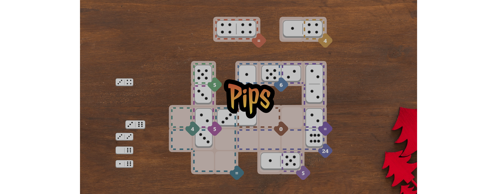

# Pips

__Puzzle:__ [Pips](https://www.codingame.com/training/medium/pips)

__Author:__ [@VizGhar](https://www.codingame.com/profile/c152bee9fe8dc90ac4f6b84505b59ebb9086993)

__Published Difficulty:__ Medium

__Algorithm X Complexity:__ Nice Exact Cover / Object-Oriented Design Opportunity

 

# Strategy

In August 2025, the *New York Times* launched a [daily logic game called **Pips**](https://www.nytimes.com/games/pips), where players place dominoes onto a grid to satisfy a set of logical conditions defined across different regions. Less than a month later, [@VizGhar](https://www.codingame.com/profile/c152bee9fe8dc90ac4f6b84505b59ebb9086993) used the [CodinGame SDK](https://www.codingame.com/playgrounds/25775/codingame-sdk-documentation/introduction) to turn Pips into a solo-game coding challenge — your task is to write a program that can solve any Pips puzzle automatically.

The overall difficulty of this challenge falls on the easier end of “medium.” Some light optimization will be required for the hardest test cases. Pips offers an excellent opportunity to sharpen both your **Algorithm X** techniques and your **object-oriented analysis and design** skills.

Cells on the game board are **grouped together by rules**, similar to puzzles like [High Rise Buildings](high-rise-buildings), [Killer Sudoku Solver](killer-sudoku-solver), and [Kakuro Solver](kakuro-solver), where groups of cells must collectively satisfy specific constraints. Pips has five different rule types, but each behaves similarly at an abstract level:

* A rule may **narrow the set of possible values** for its member cells based on logical deductions.

* A rule must also be able to **validate whether a given combination of values** across its cells is allowed.

This structure is a natural fit for **inheritance**: shared abstract behavior in a base class, with custom implementations in subclasses for each rule type.

If you’ve been looking for a fun and approachable project to explore Algorithm X and object-oriented design, this is a perfect place to dive in!