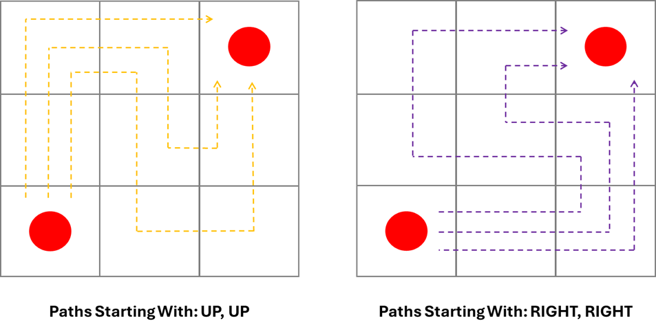

# Connect the Colours (cont.)

__Puzzle:__ Connect the Colours - Coming Soon

__Author:__ [@Harry.B.](https://www.codingame.com/profile/d926a93cb394ded661b204822965c5fa7122915)

# Strategy

This puzzle, crafted by @Harry.B., is a stellar, visual exact-cover problem using the CodinGame SDK. It earns two thumbs up for its engaging design! To succeed, you’ll need sharp grid-navigation skills to generate possible paths between pairs of same-colored endpoints. Once you’ve mastered path generation, Algorithm X can efficiently find solutions for many test cases. However, completing all test cases demands careful optimization due to the explosive growth of possible paths.

Let’s dive into what fuels the "volcanic eruption" of paths in this challenge.

# Understanding Paths in a 2x2 Grid

  

 

Consider a simple 2x2 grid with one pair of endpoints, the bottom-left corner and the top-right corner. There are exactly two distinct paths connecting these points. These are known as __nonintersecting (self-avoiding) rook paths__, adhering to two key rules:

1. A path cannot intersect itself.

1. Movement is restricted to horizontal and vertical steps, mimicking a rook’s moves in chess (up, down, left, or right).

# Scaling to a 3x3 Grid

Now, let’s examine a 3x3 grid. To simplify, consider the possible paths after the first two moves from the bottom-left to the top-right corner. There are four possible combinations of initial moves as shown below.

  

 

  

 

After the initial two steps, each path branches into three additional options. This results in __12 possible paths__ for a 3x3 grid.

This number may seem manageable, but the complexity escalates quickly with larger grids. Using a depth-first search in Python, I calculated the number of possible self-avoiding rook paths for larger grids:

* 4x4: 184 paths

* 5x5: 8,512 paths

* 6x6: 1,262,816 paths

* 7x7: 575,780,564 paths

Computing the paths for a 7x7 grid took my laptop over an hour, revealing the sheer scale of this problem. My approach was naïve, and the complexity of this challenge opened my eyes to the depth of research on self-avoiding paths. I eventually stumbled upon the Online Encyclopedia of Integer Sequences ([OEIS](https://oeis.org/wiki/Main_Page)), where I found data up to `n=27` and I also found...the fingerprints of, none other than, Donald Knuth.

