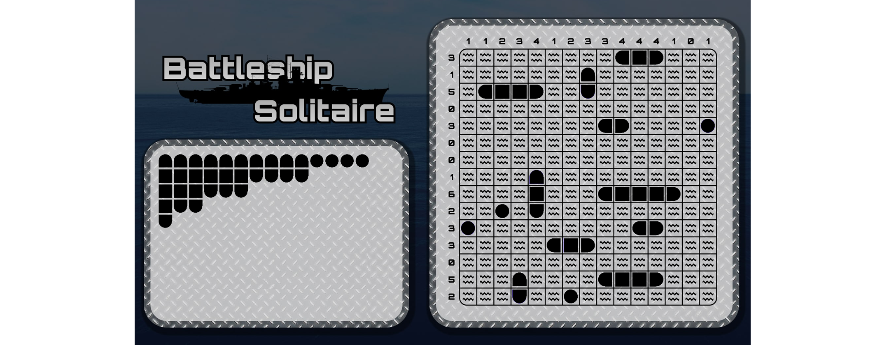

# Battleship Solitaire

__Puzzle:__ [Battleship Solitaire - COMING SOON](https://www.codingame.com/contribute/community)

__Author:__ [@VizGhar](https://www.codingame.com/profile/c152bee9fe8dc90ac4f6b84505b59ebb9086993)

__Published Difficulty:__ Hard

__Algorithm X Complexity:__ A Bit of Everything

 

# Strategy

Having completed a good number of exact cover problems, I didn’t expect this puzzle to throw me for such a loop. Coming up with an abstract model to fit the *tiles-on-a-gameboard* analogy turned out to be more difficult than expected.

**Actions:** What are the tiles being placed? The full ships? The individual ship parts? Should water cells be represented at all, or are they implied by ship placement? Modeling each possible ship placement as a single action tends to work best, but it quickly raises new constraints around overlap and adjacency.

**Mutual Exclusivity:** How can I ensure two ships do not touch, not even diagonally? In this puzzle, “no touching” extends beyond simple cell overlap — the exclusion zones around ships must also be considered. How can I determine if two potential ship placements are mutually exclusive?

**Multiplicity and Steering:** How can I ensure the proper number of ship cells appear in each row and column, and that the correct number of ships of each size are used? Representing the ship inventory and row/column quotas as separate constraint sets provides good control here, though it takes careful thought to keep the model both complete and minimal.

The test case progression for this puzzle is extremely well done, letting you build your Algorithm X requirements and actions step by step. With a solid DLX setup, you’ll solve many test cases cleanly, and a small bit of logic based on the initial gameboard hints will take you close to the finish line.

Solving these Battleship Solitaire grids *without* backtracking is a wonderful experience in itself. To explore strategies for introducing more hints or logical deductions before searching with Algorithm X, consider [playing a few games by hand](https://lukerissacher.com/battleships).

# Solving Logic Puzzle Logically 💯

All Battleship Solitaire test cases and validators can be solved without making any guesses. It’s not an easy row to hoe, but if you enjoy a pure logic challenge, this one delivers. Click [here](solving-with-logic-only) to see my ongoing progress toward solving as many logic puzzles as possible — strictly with reasoning, no guessing, and no backtracking.